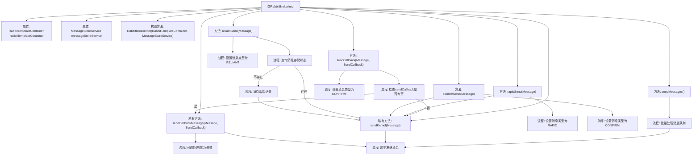
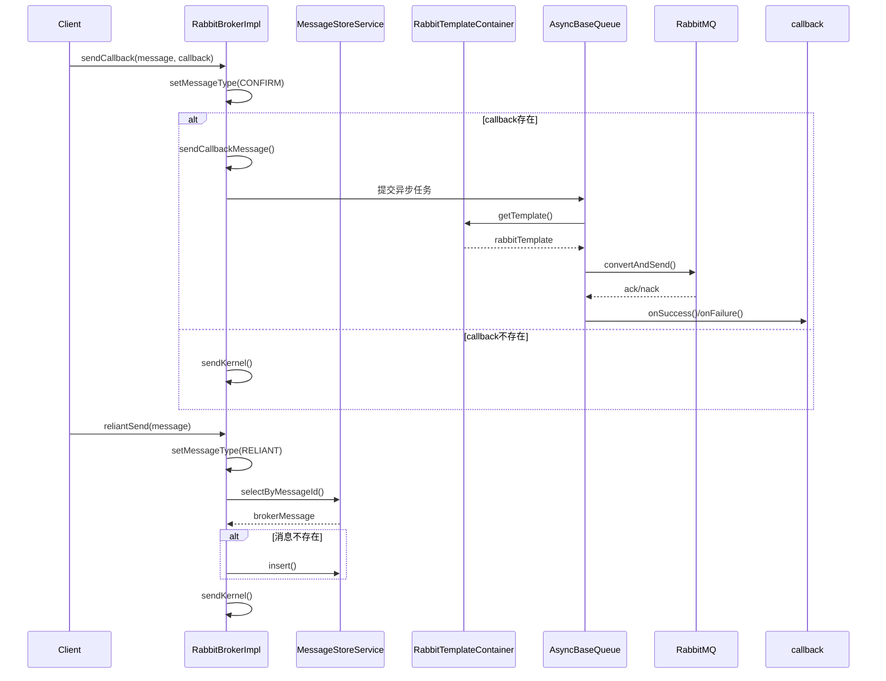

# 基础信息

|      |      |
|------|------|
| 名称 | RabbitBrokerImpl |
| 编码语言 | .java |
| 代码路径 | rabbit-parent/rabbit-core-producer/src/main/java/com/itihub/rabbit/producer/broker/RabbitBrokerImpl.java |
| 包名 | com.itihub.rabbit.producer.broker |
| 依赖项 | ['com.itihub.rabbit.api.Message', 'com.itihub.rabbit.api.MessageType', 'com.itihub.rabbit.api.SendCallback', 'com.itihub.rabbit.producer.constant.BrokerMessageConst', 'com.itihub.rabbit.producer.constant.BrokerMessageStatus', 'com.itihub.rabbit.producer.entity.BrokerMessage', 'com.itihub.rabbit.producer.service.MessageStoreService', 'lombok.extern.slf4j.Slf4j', 'org.apache.commons.lang3.time.DateUtils', 'org.springframework.amqp.rabbit.connection.CorrelationData', 'org.springframework.amqp.rabbit.core.RabbitTemplate', 'java.util.Date', 'java.util.List', 'java.util.concurrent.ExecutionException'] |
| 概述说明 | RabbitBroker实现类，提供多种消息发送方式，支持回调、快速、确认和可靠发送，核心方法异步处理消息。 |

# 说明

RabbitBrokerImpl类实现了RabbitBroker接口，提供多种消息发送方式。通过RabbitTemplateContainer和MessageStoreService依赖注入，支持回调发送、快速发送、确认发送和可靠发送。可靠发送会将消息先存入数据库再发送到MQ。核心方法sendKernel使用异步线程池发送消息，包含消息ID、时间戳和类型。sendCallbackMessage处理回调结果，根据ACK状态调用成功或失败回调。sendMessages方法批量处理消息队列中的消息。所有发送操作均记录日志。

# 类列表 Class Summary

| 名称   | 类型  | 说明 |
|-------|------|-------------|
| RabbitBrokerImpl | class | RabbitBrokerImpl实现消息发送功能，支持回调、快速、确认和可靠发送，使用异步线程池处理。 |


## 类 RabbitBrokerImpl

|      |      |
|------|------|
| 访问范围 | @Slf4j;public |
| 类型 | class |
| 名称 | RabbitBrokerImpl |
| 说明 | RabbitBrokerImpl实现消息发送功能，支持回调、快速、确认和可靠发送，使用异步线程池处理。 |


### UML类图

```mermaid
classDiagram
    class RabbitBrokerImpl {
        -RabbitTemplateContainer rabbitTemplateContainer
        -MessageStoreService messageStoreService
        +RabbitBrokerImpl(RabbitTemplateContainer, MessageStoreService)
        +sendCallback(Message, SendCallback) void
        +rapidSend(Message) void
        +confirmSend(Message) void
        +reliantSend(Message) void
        +sendMessages() void
        -sendKernel(Message) void
        -sendCallbackMessage(Message, SendCallback) void
    }

    interface RabbitBroker {
        <<Interface>>
        +sendCallback(Message, SendCallback) void
        +rapidSend(Message) void
        +confirmSend(Message) void
        +reliantSend(Message) void
        +sendMessages() void
    }

    class RabbitTemplateContainer {
        +getTemplate(Message) RabbitTemplate
    }

    class MessageStoreService {
        +selectByMessageId(String) BrokerMessage
        +insert(BrokerMessage) void
    }

    class Message {
        -String messageId
        -MessageType messageType
        -String topic
        -String routingKey
        +setMessageType(MessageType) void
        +getMessageId() String
        +getTopic() String
        +getRoutingKey() String
    }

    class BrokerMessage {
        -String messageId
        -int status
        -Date nextRetry
        -Date createTime
        -Date updateTime
        -Message message
    }

    RabbitBrokerImpl ..|> RabbitBroker : 实现
    RabbitBrokerImpl --> RabbitTemplateContainer : 依赖
    RabbitBrokerImpl --> MessageStoreService : 依赖
    MessageStoreService --> BrokerMessage : 操作
    reliantSend --> MessageStoreService : 调用
    sendKernel --> RabbitTemplateContainer : 调用
```

这段类图展示了RabbitBrokerImpl实现RabbitBroker接口的核心结构，该类通过RabbitTemplateContainer和MessageStoreService完成消息发送与存储功能。主要包含四种发送模式（回调/快速/确认/可靠），其中可靠发送会先持久化消息到数据库。所有发送最终通过sendKernel核心方法异步调用RabbitMQ模板，类间依赖关系清晰体现了消息处理流程的分层架构。


### 内部方法调用关系图





这段代码实现了一个RabbitMQ消息代理服务，提供四种消息发送模式：带回调的确认发送、快速发送、确认发送和可靠发送。核心逻辑通过异步队列处理消息发送，可靠发送模式会先将消息持久化到数据库再发送。流程图展示了类结构和主要方法调用关系，时序图则详细描述了带回调发送和可靠发送两种典型场景的交互流程。代码通过模板容器获取连接、支持消息存储服务集成，并实现了完整的回调处理机制。

### 字段列表 Field List

| 名称  | 类型  | 说明 |
|-------|-------|------|
| messageStoreService | MessageStoreService | 私有消息存储服务实例 |
| rabbitTemplateContainer | RabbitTemplateContainer | 私有RabbitTemplate容器变量 |

### 方法列表 Method List

| 名称  | 类型  | 说明 |
|-------|-------|------|
| sendCallbackMessage | void | 发送回调消息至RabbitMQ，处理成功或失败回调。 |
| sendMessages | void | 重写sendMessages方法，异步发送消息到RabbitMQ，记录日志。 |
| rapidSend | void | 重写方法快速发送消息，设置类型为RAPID后调用内核发送。 |
| confirmSend | void | 重写confirmSend方法，设置消息类型为CONFIRM并发送。 |
| sendCallback | void | 方法重写，根据回调存在性选择发送方式。 |
| sendKernel | void | 异步发送消息至RabbitMQ，包含消息ID、时间戳和类型，记录日志。 |
| reliantSend | void | 重写reliantSend方法，处理消息存储和发送逻辑，确保可靠投递。 |


