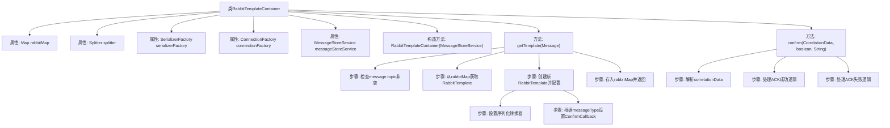

# 基础信息

|      |      |
|------|------|
| 名称 | RabbitTemplateContainer |
| 编码语言 | .java |
| 代码路径 | rabbit-parent/rabbit-core-producer/src/main/java/com/itihub/rabbit/producer/broker/RabbitTemplateContainer.java |
| 包名 | com.itihub.rabbit.producer.broker |
| 依赖项 | ['com.google.common.base.Preconditions', 'com.google.common.base.Splitter', 'com.google.common.collect.Maps', 'com.itihub.rabbit.api.Message', 'com.itihub.rabbit.api.MessageType', 'com.itihub.rabbit.common.convert.GenericMessageConverter', 'com.itihub.rabbit.common.convert.RabbitMessageConverter', 'com.itihub.rabbit.common.serializer.Serializer', 'com.itihub.rabbit.common.serializer.SerializerFactory', 'com.itihub.rabbit.common.serializer.impl.JacksonSerializerFactory', 'com.itihub.rabbit.exception.MessageRunTimeException', 'com.itihub.rabbit.producer.service.MessageStoreService', 'lombok.extern.slf4j.Slf4j', 'org.springframework.amqp.rabbit.connection.ConnectionFactory', 'org.springframework.amqp.rabbit.connection.CorrelationData', 'org.springframework.amqp.rabbit.core.RabbitTemplate', 'org.springframework.beans.factory.annotation.Autowired', 'org.springframework.retry.support.RetryTemplate', 'org.springframework.stereotype.Component', 'java.util.List', 'java.util.Map'] |
| 概述说明 | RabbitTemplate容器类，管理RabbitTemplate实例，处理消息确认回调。 |

# 说明

RabbitTemplateContainer类是一个管理RabbitTemplate的容器，实现了RabbitTemplate.ConfirmCallback接口。它使用ConcurrentMap存储不同topic对应的RabbitTemplate实例。构造函数注入MessageStoreService用于消息状态管理。核心方法getTemplate根据消息topic获取或创建RabbitTemplate，配置序列化转换器、重试模板和确认回调（非RAPID类型消息）。confirm方法处理消息确认逻辑：成功时更新可靠消息状态为SEND_OK，失败时记录错误日志。类中使用Splitter解析消息ID，包含消息ID、发送时间和类型。序列化使用JacksonSerializerFactory。

# 类列表 Class Summary

| 名称   | 类型  | 说明 |
|-------|------|-------------|
| RabbitTemplateContainer | class | RabbitTemplate容器管理模板，支持消息序列化和ACK确认。 |


## 类 RabbitTemplateContainer

|      |      |
|------|------|
| 访问范围 | @Slf4j;public |
| 类型 | class |
| 名称 | RabbitTemplateContainer |
| 说明 | RabbitTemplate容器管理模板，支持消息序列化和ACK确认。 |


### UML类图

```mermaid
classDiagram
    class RabbitTemplateContainer {
        -Map~String, RabbitTemplate~ rabbitMap
        -Splitter splitter
        -SerializerFactory serializerFactory
        -ConnectionFactory connectionFactory
        -MessageStoreService messageStoreService
        +RabbitTemplateContainer(MessageStoreService messageStoreService)
        +RabbitTemplate getTemplate(Message message) RabbitTemplate
        +void confirm(CorrelationData correlationData, boolean ack, String cause)
    }

    class RabbitTemplate {
        <<Interface>>
        +setExchange(String exchange)
        +setRoutingKey(String routingKey)
        +setRetryTemplate(RetryTemplate retryTemplate)
        +setMessageConverter(MessageConverter messageConverter)
        +setConfirmCallback(ConfirmCallback callback)
    }

    class MessageStoreService {
        <<Interface>>
        +success(String messageId)
    }

    class SerializerFactory {
        <<Interface>>
        +create() Serializer
    }

    RabbitTemplateContainer --> RabbitTemplate : 创建和管理
    RabbitTemplateContainer --> MessageStoreService : 依赖
    RabbitTemplateContainer --> SerializerFactory : 使用
    RabbitTemplateContainer ..|> RabbitTemplate$ConfirmCallback : 实现
```

类图描述：
RabbitTemplateContainer 是一个管理 RabbitTemplate 实例的容器类，通过 topic 存储和获取对应的 RabbitTemplate。它实现了 RabbitTemplate.ConfirmCallback 接口来处理消息确认回调，依赖 MessageStoreService 来更新消息状态，使用 SerializerFactory 进行消息序列化。该类主要负责创建、配置 RabbitTemplate 实例，并处理消息发送的确认逻辑，支持可靠消息和快速消息两种类型。


### 内部方法调用关系图



流程图描述：该流程图展示了RabbitTemplateContainer类的核心结构和处理流程。类包含5个主要属性和3个关键方法，其中getTemplate方法实现模板获取/创建逻辑，涉及参数校验、缓存查询、模板配置（含序列化设置和回调注册）等步骤；confirm方法处理消息确认结果，包含数据解析和成功/失败分支处理。整体设计实现了RabbitTemplate的缓存管理和消息确认机制，特别关注了消息类型区分和序列化处理。

### 字段列表 Field List

| 名称  | 类型  | 说明 |
|-------|-------|------|
| splitter = Splitter.on("#") | Splitter | 定义私有分割器，以"#"为分隔符。 |
| connectionFactory | ConnectionFactory | 自动注入连接工厂实例 |
| messageStoreService | MessageStoreService | 私有消息存储服务实例。 |
| serializerFactory = JacksonSerializerFactory.INSTANCE | SerializerFactory | 私有序列化工厂实例设为JacksonSerializerFactory.INSTANCE。 |
| rabbitMap = Maps.newConcurrentMap() | Map<String, RabbitTemplate> | 私有并发映射，键为字符串，值为RabbitTemplate对象。 |

### 方法列表 Method List

| 名称  | 类型  | 说明 |
|-------|-------|------|
| getTemplate | RabbitTemplate | 获取或创建RabbitTemplate，配置序列化、消息转换器和回调。 |
| confirm | void | 消息确认处理：成功更新状态，失败记录日志。 |


