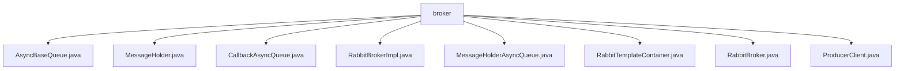

# 基础信息

|      |      |
|------|------|
| 名称 | broker |
| 编码语言 | .java |
| 代码路径 | rabbit-parent/rabbit-core-producer/src/main/java/com/itihub/rabbit/producer/broker |
| 包名 | rabbit-parent.docs.rabbit-core-producer.src.main.java.com.itihub.rabbit.producer.broker |
| 概述说明 | 异步消息处理工具类，含线程池管理、消息发送及回调功能。 |

# 说明

## 概述  
该代码模块是一个基于RabbitMQ的消息生产者实现，主要提供异步消息发送、消息管理以及可靠性保证等功能。模块核心功能包括：  
1. **异步消息处理**：通过线程池（`AsyncBaseQueue`、`CallbackAsyncQueue`、`MessageHolderAsyncQueue`）实现高性能的异步消息发送，支持任务提交、线程池配置（线程数、队列容量、线程命名等）和任务拒绝处理。  
2. **消息管理**：`MessageHolder`利用`ThreadLocal`实现线程安全的消息列表管理，支持消息的批量操作。  
3. **消息发送策略**：通过`RabbitBrokerImpl`实现多种消息发送方式（回调发送、快速发送、确认发送、可靠发送），并依赖`RabbitTemplateContainer`管理RabbitMQ连接模板。  
4. **可靠性保证**：可靠发送（`reliantSend`）通过消息落库和重试机制确保消息不丢失，支持ACK确认和状态更新。  

## 主要业务场景  
1. **异步消息发送**：  
   - 使用线程池（如`AsyncBaseQueue`）提交任务，支持高并发场景下的消息异步处理。  
   - 通过`ProducerClient`提供多种发送方式（带回调、同步、批量），适配不同业务需求。  

2. **消息可靠性传输**：  
   - **可靠发送**：消息先持久化到数据库，再发送到MQ，确保消息不丢失（`RabbitBrokerImpl.reliantSend`）。  
   - **ACK确认**：通过`RabbitTemplateContainer.confirm`处理Broker的ACK/NACK，更新消息状态或记录错误日志。  

3. **批量消息处理**：  
   - 利用`MessageHolder`临时存储批量消息，通过`sendMessages`方法统一发送，减少网络开销。  

4. **动态连接管理**：  
   - `RabbitTemplateContainer`根据消息topic动态创建/复用`RabbitTemplate`实例，配置序列化、重试策略和回调逻辑。  

5. **线程安全与资源隔离**：  
   - 通过`ThreadLocal`（`MessageHolder`）确保线程间消息隔离，避免并发冲突。  
   - 线程池资源隔离（如`MessageHolderAsyncQueue`专用于消息持有者异步操作）。  

**关键组件协作流程**：  
1. 用户调用`ProducerClient`发送消息（单条或批量）。  
2. `RabbitBrokerImpl`根据消息类型选择发送策略（如可靠发送会先落库）。  
3. 异步线程池（如`CallbackAsyncQueue`）处理消息发送任务。  
4. `RabbitTemplateContainer`管理MQ连接，处理ACK回调并更新状态。  
5. 失败时记录日志或触发重试机制。

### 包内部结构视图

该流程图展示了rabbit-core-producer模块中broker目录下的文件结构关系。所有Java类文件都直接隶属于broker节点，包括AsyncBaseQueue、MessageHolder等8个核心生产者组件文件，这些文件共同构成了消息队列生产者的基础功能实现。图中清晰呈现了扁平化的文件组织结构，没有更深层次的子目录嵌套。

# 文件列表 File List

| 名称   | 类型  | 说明 |
|-------|------|-------------|
| [MessageHolder.java](MessageHolder.md) | file | 线程安全的MessageHolder类，存储消息列表，支持添加和清空操作。 |
| [AsyncBaseQueue.java](AsyncBaseQueue.md) | file | 异步消息队列线程池，核心线程数等于CPU数，队列容量10000，拒绝策略记录错误日志。 |
| [ProducerClient.java](ProducerClient.md) | file | ProducerClient通过RabbitBroker发送消息，支持单条和批量发送，按消息类型选择不同发送方式。 |
| [RabbitBroker.java](RabbitBroker.md) | file | RabbitBroker接口提供五种消息发送方式：异步回调、无ACK快速、有ACK确认、可靠重试及批量发送。 |
| [MessageHolderAsyncQueue.java](MessageHolderAsyncQueue.md) | file | 异步消息线程池，核心线程数等于CPU数，队列容量1万，线程名自定义，拒绝策略记录错误日志。 |
| [RabbitBrokerImpl.java](RabbitBrokerImpl.md) | file | RabbitBroker实现类，提供多种消息发送方式，支持回调、快速、确认和可靠发送，核心方法异步处理消息。 |
| [CallbackAsyncQueue.java](CallbackAsyncQueue.md) | file | 异步线程池处理消息，线程数等于CPU核数，队列大小10000，拒绝时记录错误。 |
| [RabbitTemplateContainer.java](RabbitTemplateContainer.md) | file | RabbitTemplate容器类，管理RabbitTemplate实例，处理消息确认回调。 |

