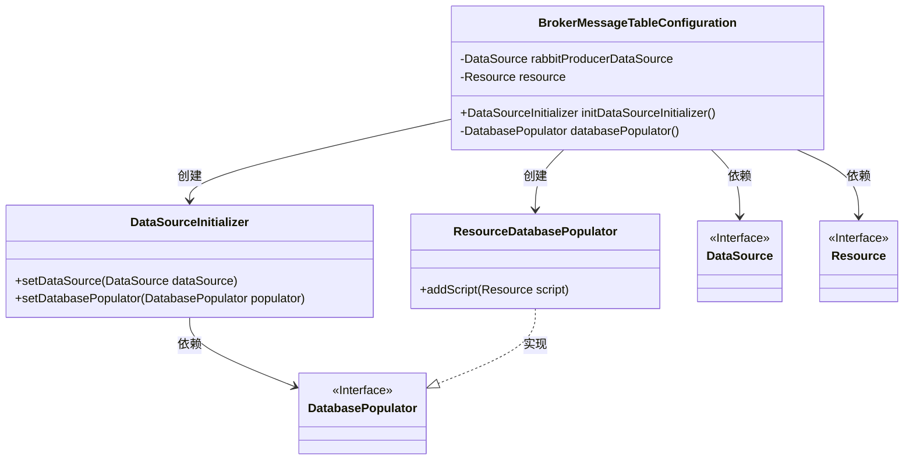
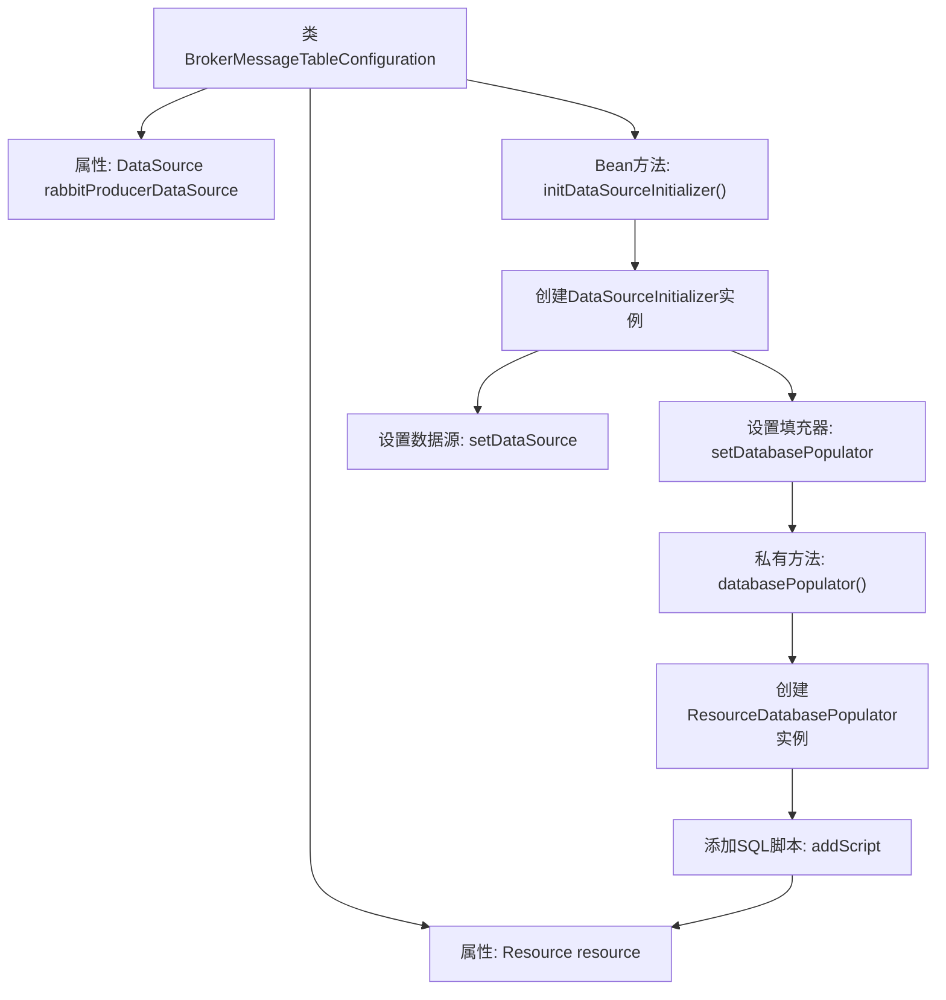

# 基础信息

|      |      |
|------|------|
| 名称 | BrokerMessageTableConfiguration |
| 编码语言 | .java |
| 代码路径 | rabbit-parent/rabbit-core-producer/src/main/java/com/itihub/rabbit/producer/config/database/BrokerMessageTableConfiguration.java |
| 包名 | com.itihub.rabbit.producer.config.database |
| 依赖项 | ['org.springframework.beans.factory.annotation.Autowired', 'org.springframework.beans.factory.annotation.Value', 'org.springframework.context.annotation.Bean', 'org.springframework.context.annotation.Configuration', 'org.springframework.core.io.Resource', 'org.springframework.jdbc.datasource.init.DataSourceInitializer', 'org.springframework.jdbc.datasource.init.DatabasePopulator', 'org.springframework.jdbc.datasource.init.ResourceDatabasePopulator', 'javax.sql.DataSource'] |
| 概述说明 | 配置类，初始化数据源并执行SQL脚本创建表结构。 |

# 说明

该配置类用于初始化RabbitMQ生产者消息表结构。通过注入数据源rabbitProducerDataSource和SQL脚本资源rabbit-producer-message-schema.sql，创建了一个DataSourceInitializer Bean。该初始化器使用ResourceDatabasePopulator来执行指定的SQL脚本，从而完成数据库表结构的创建和初始化工作。整个过程实现了数据源的自动配置和表结构的自动化部署。

# 类列表 Class Summary

| 名称   | 类型  | 说明 |
|-------|------|-------------|
| BrokerMessageTableConfiguration | class | 配置类，初始化数据源并执行SQL脚本。 |

## 类 BrokerMessageTableConfiguration

|      |      |
|------|------|
| 访问范围 | @Configuration;public |
| 类型 | class |
| 名称 | BrokerMessageTableConfiguration |
| 说明 | 配置类，初始化数据源并执行SQL脚本。 |

### UML类图

这段类图描述了BrokerMessageTableConfiguration的配置类结构，它通过依赖注入获取DataSource和Resource资源，并创建DataSourceInitializer来初始化数据库。DataSourceInitializer使用ResourceDatabasePopulator（实现了DatabasePopulator接口）来执行SQL脚本。整个结构展示了Spring配置类如何整合数据源初始化组件，实现数据库表结构的自动化部署。

### 内部方法调用关系图

这段代码是Spring Boot的配置类，主要功能是初始化RabbitMQ生产者消息表结构。通过@Value加载SQL脚本资源，创建DataSourceInitializer来设置数据源和数据库填充器。私有方法databasePopulator()负责创建脚本执行器并添加SQL脚本，最终在应用启动时自动执行建表语句。整个流程展现了Spring配置类如何通过分层调用来完成数据库初始化工作。

### 字段列表 Field List

| 名称  | 类型  | 说明 |
|-------|-------|------|
| rabbitProducerDataSource | DataSource | 自动注入RabbitMQ生产者数据源 |
| resource | Resource | 使用@Value注入RabbitMQ生产者消息模式的SQL资源文件。 |

### 方法列表 Method List

| 名称  | 类型  | 说明 |
|-------|-------|------|
| initDataSourceInitializer | DataSourceInitializer | 创建DataSourceInitializer实例，设置数据源和数据库填充器。 |
| databasePopulator | DatabasePopulator | 创建并配置数据库填充器，添加脚本资源后返回。 |

