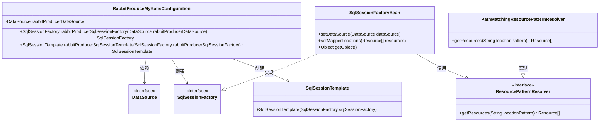
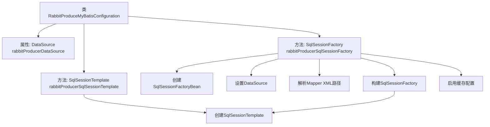

# 基础信息

|      |      |
|------|------|
| 名称 | RabbitProduceMyBatisConfiguration |
| 编码语言 | .java |
| 代码路径 | rabbit-parent/rabbit-core-producer/src/main/java/com/itihub/rabbit/producer/config/database/RabbitProduceMyBatisConfiguration.java |
| 包名 | com.itihub.rabbit.producer.config.database |
| 依赖项 | ['org.apache.ibatis.session.SqlSessionFactory', 'org.mybatis.spring.SqlSessionFactoryBean', 'org.mybatis.spring.SqlSessionTemplate', 'org.springframework.boot.autoconfigure.AutoConfigureAfter', 'org.springframework.context.annotation.Bean', 'org.springframework.context.annotation.Configuration', 'org.springframework.core.io.support.PathMatchingResourcePatternResolver', 'org.springframework.core.io.support.ResourcePatternResolver', 'javax.annotation.Resource', 'javax.sql.DataSource', 'org.springframework.core.io.support.ResourcePatternResolver.CLASSPATH_ALL_URL_PREFIX'] |
| 概述说明 | 配置RabbitProducer的MyBatis组件，包括SqlSessionFactory和SqlSessionTemplate。 |

# 说明

这是一个Spring配置类，用于配置RabbitProducer相关的MyBatis组件。它依赖名为rabbitProducerDataSource的数据源，并创建了两个Bean：rabbitProducerSqlSessionFactory和rabbitProducerSqlSessionTemplate。SqlSessionFactory配置了数据源和Mapper XML文件路径，启用了缓存功能。SqlSessionTemplate基于该SqlSessionFactory创建。配置类在RabbitProducerDataSourceConfiguration之后加载。

# 类列表 Class Summary

| 名称   | 类型  | 说明 |
|-------|------|-------------|
| RabbitProduceMyBatisConfiguration | class | 配置RabbitProducer的MyBatis组件，包含SqlSessionFactory和SqlSessionTemplate。 |

## 类 RabbitProduceMyBatisConfiguration

|      |      |
|------|------|
| 访问范围 | @Configuration;@AutoConfigureAfter(value = {RabbitProducerDataSourceConfiguration.class});public |
| 类型 | class |
| 名称 | RabbitProduceMyBatisConfiguration |
| 说明 | 配置RabbitProducer的MyBatis组件，包含SqlSessionFactory和SqlSessionTemplate。 |

### UML类图

这段类图描述了RabbitProduceMyBatisConfiguration的配置类结构，它通过依赖注入获取DataSource，并创建SqlSessionFactory和SqlSessionTemplate。SqlSessionFactoryBean实现了SqlSessionFactory接口，使用ResourcePatternResolver加载Mapper XML文件。PathMatchingResourcePatternResolver是ResourcePatternResolver的实现类，用于解析资源路径。整个结构展示了Spring Boot与MyBatis整合时，如何配置数据库会话工厂和模板的核心组件关系。

### 内部方法调用关系图

这段代码是Spring Boot中配置MyBatis与RabbitMQ生产者数据源的配置类。流程图展示了类结构、属性注入关系以及两个核心Bean的创建流程：首先通过DataSource构建SqlSessionFactory（包含XML映射文件加载和缓存配置），然后基于该工厂创建SqlSessionTemplate。整个过程体现了Spring依赖注入和MyBatis初始化的典型模式，异常处理采用RuntimeException封装检查异常。

### 字段列表 Field List

| 名称  | 类型  | 说明 |
|-------|-------|------|
| rabbitProducerDataSource | DataSource | 声明RabbitMQ生产者数据源 |

### 方法列表 Method List

| 名称  | 类型  | 说明 |
|-------|-------|------|
| rabbitProducerSqlSessionFactory | SqlSessionFactory | 创建名为rabbitProducerSqlSessionFactory的Bean，配置数据源和MyBatis XML路径，启用缓存。 |
| rabbitProducerSqlSessionTemplate | SqlSessionTemplate | 定义RabbitMQ生产者SQL会话模板，基于指定工厂创建。 |

