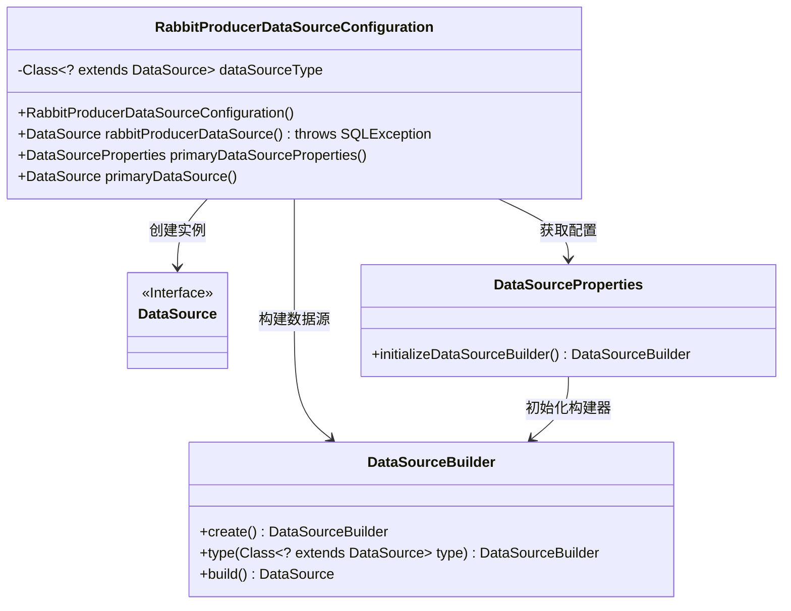
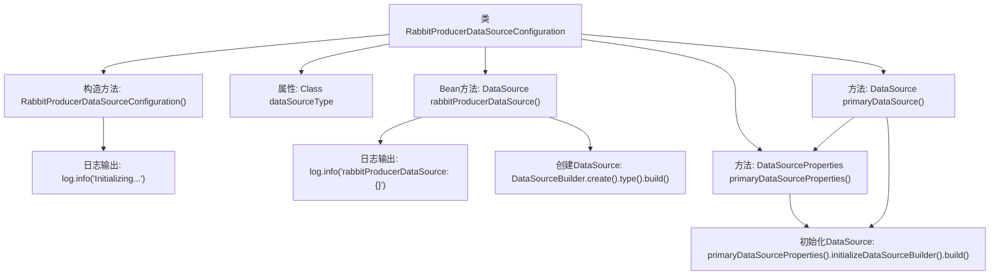

# 基础信息

|      |      |
|------|------|
| 名称 | RabbitProducerDataSourceConfiguration |
| 编码语言 | .java |
| 代码路径 | rabbit-parent/rabbit-core-producer/src/main/java/com/itihub/rabbit/producer/config/database/RabbitProducerDataSourceConfiguration.java |
| 包名 | com.itihub.rabbit.producer.config.database |
| 依赖项 | ['lombok.extern.slf4j.Slf4j', 'org.springframework.beans.factory.annotation.Value', 'org.springframework.boot.autoconfigure.jdbc.DataSourceProperties', 'org.springframework.boot.context.properties.ConfigurationProperties', 'org.springframework.boot.jdbc.DataSourceBuilder', 'org.springframework.context.annotation.Bean', 'org.springframework.context.annotation.Configuration', 'org.springframework.context.annotation.Primary', 'org.springframework.context.annotation.PropertySource', 'javax.sql.DataSource', 'java.sql.SQLException'] |
| 概述说明 | RabbitProducerDataSource配置类，初始化Druid数据源并设为主数据源。 |

# 说明

这是一个名为RabbitProducerDataSourceConfiguration的Java配置类，用于初始化RabbitMQ生产者数据源。该类使用@PropertySource注解加载配置文件，通过@Value注入Druid连接池类型。核心方法是@Bean标注的rabbitProducerDataSource()，它使用DataSourceBuilder创建数据源实例，并设置为@Primary主数据源。类中还包含两个辅助方法primaryDataSourceProperties()和primaryDataSource()用于获取数据源属性及构建数据源。初始化时会记录日志信息。

# 类列表 Class Summary

| 名称   | 类型  | 说明 |
|-------|------|-------------|
| RabbitProducerDataSourceConfiguration | class | RabbitMQ生产者数据源配置类，使用Druid连接池，主数据源。 |

## 类 RabbitProducerDataSourceConfiguration

|      |      |
|------|------|
| 访问范围 | @Slf4j;@Configuration;@PropertySource({"classpath:rabbit-producer-message.properties"});public |
| 类型 | class |
| 名称 | RabbitProducerDataSourceConfiguration |
| 说明 | RabbitMQ生产者数据源配置类，使用Druid连接池，主数据源。 |

### UML类图

类图描述：该图展示了RabbitProducerDataSourceConfiguration类如何通过DataSourceBuilder和DataSourceProperties来创建和管理数据源。RabbitProducerDataSourceConfiguration作为配置类，依赖DataSource接口实现数据源功能，使用DataSourceBuilder构建具体实例，并通过DataSourceProperties获取配置信息，最终生成主数据源供系统使用。

### 内部方法调用关系图

该流程图展示了RabbitProducerDataSourceConfiguration类的核心结构。类通过构造方法初始化时记录日志，包含一个通过@Value注入的dataSourceType属性。主要功能是通过@Bean标注的rabbitProducerDataSource()方法创建数据源，该方法使用DataSourceBuilder构建并返回DataSource实例。辅助方法primaryDataSourceProperties()和primaryDataSource()提供了备用数据源初始化路径。所有关键操作都通过SLF4J日志记录执行过程，体现了配置类对Druid连接池的完整管理能力。

### 字段列表 Field List

| 名称  | 类型  | 说明 |
|-------|-------|------|
| dataSourceType | Class<? extends DataSource> | 配置RabbitMQ生产者数据源类型 |

### 方法列表 Method List

| 名称  | 类型  | 说明 |
|-------|-------|------|
| rabbitProducerDataSource | DataSource | 创建名为rabbitProducerDataSource的主数据源，配置前缀为rabbit.producer.druid.jdbc，记录日志后返回。 |
| primaryDataSourceProperties | DataSourceProperties | 定义主数据源配置方法，返回DataSourceProperties实例。 |
| primaryDataSource | DataSource | 创建主数据源实例并初始化。 |

