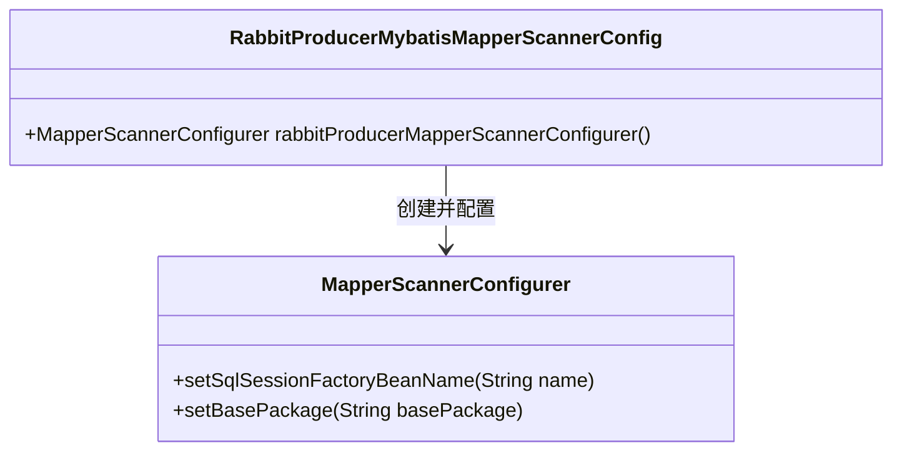
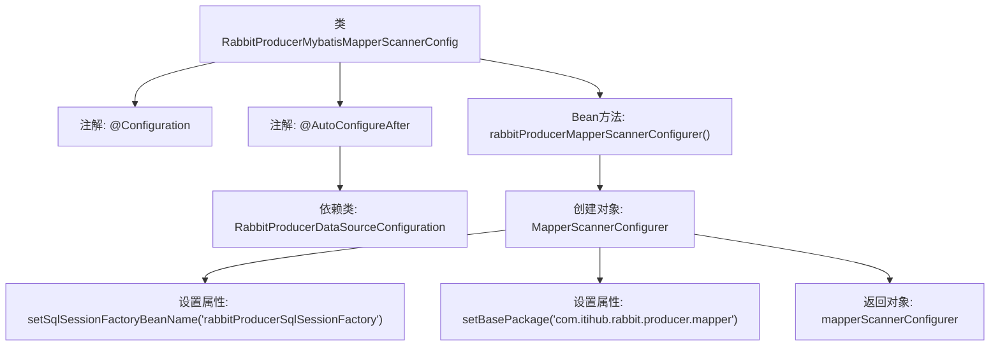

# 基础信息

|      |      |
|------|------|
| 名称 | RabbitProducerMybatisMapperScannerConfig |
| 编码语言 | .java |
| 代码路径 | rabbit-parent/rabbit-core-producer/src/main/java/com/itihub/rabbit/producer/config/database/RabbitProducerMybatisMapperScannerConfig.java |
| 包名 | com.itihub.rabbit.producer.config.database |
| 依赖项 | ['org.mybatis.spring.mapper.MapperScannerConfigurer', 'org.springframework.boot.autoconfigure.AutoConfigureAfter', 'org.springframework.context.annotation.Bean', 'org.springframework.context.annotation.Configuration'] |
| 概述说明 | 配置RabbitProducer的MyBatis Mapper扫描器，指定SqlSessionFactory和基础包路径。 |

# 说明

这是一个名为RabbitProducerMybatisMapperScannerConfig的Spring配置类，用于配置MyBatis的Mapper扫描器。该类标注了@Configuration注解，表示它是一个配置类，并通过@AutoConfigureAfter注解指定在RabbitProducerDataSourceConfiguration类之后自动配置。该类定义了一个名为rabbitProducerMapperScannerConfigurer的Bean，该Bean是一个MapperScannerConfigurer实例，用于配置MyBatis的Mapper接口扫描。配置中指定了SqlSessionFactory的Bean名称为rabbitProducerSqlSessionFactory，并设置了Mapper接口的基础包路径为com.itihub.rabbit.producer.mapper。该配置类的主要作用是自动扫描指定包下的Mapper接口并将其注册为Spring的Bean。

# 类列表 Class Summary

| 名称   | 类型  | 说明 |
|-------|------|-------------|
| RabbitProducerMybatisMapperScannerConfig | class | 配置RabbitProducer的MyBatis Mapper扫描器，指定SqlSessionFactory和基础包路径。 |

## 类 RabbitProducerMybatisMapperScannerConfig

|      |      |
|------|------|
| 访问范围 | @Configuration;@AutoConfigureAfter(RabbitProducerDataSourceConfiguration.class);public |
| 类型 | class |
| 名称 | RabbitProducerMybatisMapperScannerConfig |
| 说明 | 配置RabbitProducer的MyBatis Mapper扫描器，指定SqlSessionFactory和基础包路径。 |

### UML类图

这段代码展示了一个Spring配置类`RabbitProducerMybatisMapperScannerConfig`，它通过`@Bean`方法创建并配置了一个`MapperScannerConfigurer`实例。该类的主要作用是为MyBatis设置Mapper接口的扫描配置，指定了SQL会话工厂的Bean名称和Mapper接口的基础包路径。这是一个典型的MyBatis-Spring整合配置，用于自动化扫描和注册Mapper接口。

### 内部方法调用关系图

这段代码是一个Spring配置类，用于配置MyBatis的Mapper扫描器。类通过@Configuration注解标记为配置类，并依赖RabbitProducerDataSourceConfiguration完成自动配置。核心方法是创建MapperScannerConfigurer实例，设置SQL会话工厂名称和Mapper接口的基础包路径，最终返回配置好的扫描器实例。该配置实现了MyBatis Mapper接口的自动发现和注册功能。

### 字段列表 Field List

| 名称  | 类型  | 说明 |
|-------|-------|------|

### 方法列表 Method List

| 名称  | 类型  | 说明 |
|-------|-------|------|
| rabbitProducerMapperScannerConfigurer | MapperScannerConfigurer | 定义名为rabbitProducerMapperScannerConfigurer的Bean，配置Mapper扫描器，设置SQL会话工厂和基础包路径。 |

