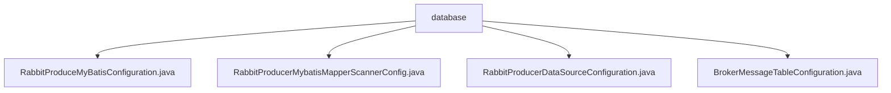

# 基础信息

|      |      |
|------|------|
| 名称 | database |
| 编码语言 | .java |
| 代码路径 | rabbit-parent/rabbit-core-producer/src/main/java/com/itihub/rabbit/producer/config/database |
| 包名 | rabbit-parent.docs.rabbit-core-producer.src.main.java.com.itihub.rabbit.producer.config.database |
| 概述说明 | Spring配置类集合：配置RabbitMQ生产者的数据源、MyBatis组件、Mapper扫描及消息表初始化。 |

# 说明

## 概述
该代码模块是一个基于Spring框架的RabbitMQ生产者数据访问层配置模块，主要负责RabbitMQ生产者相关的数据库连接、MyBatis集成以及消息表结构初始化工作。模块通过多个配置类实现了数据源的创建与配置、MyBatis组件的初始化、Mapper接口的自动扫描以及消息表结构的自动化部署。

## 主要业务场景
1. **数据源配置**：通过`RabbitProducerDataSourceConfiguration`类加载配置文件并初始化Druid连接池，创建主数据源实例。
2. **MyBatis集成**：
   - `RabbitProduceMyBatisConfiguration`配置MyBatis核心组件（SqlSessionFactory和SqlSessionTemplate），指定数据源和Mapper XML路径。
   - `RabbitProducerMybatisMapperScannerConfig`自动扫描指定包路径下的Mapper接口并注册为Spring Bean。
3. **数据库表初始化**：`BrokerMessageTableConfiguration`通过执行SQL脚本自动创建和初始化RabbitMQ生产者消息表结构。
4. **依赖管理**：各配置类通过`@AutoConfigureAfter`确保正确的加载顺序，形成完整的数据访问层配置链。

### 包内部结构视图

该流程图展示了RabbitMQ生产者模块中数据库配置相关的文件结构。根节点"database"下包含四个MyBatis和数据库连接配置类文件，分别处理MyBatis配置、Mapper扫描、数据源配置和消息表配置。这些配置类共同构成了生产者模块的数据库访问层基础架构。

# 文件列表 File List

| 名称   | 类型  | 说明 |
|-------|------|-------------|
| [BrokerMessageTableConfiguration.java](BrokerMessageTableConfiguration.md) | file | 配置类，初始化数据源并执行SQL脚本创建表结构。 |
| [RabbitProducerDataSourceConfiguration.java](RabbitProducerDataSourceConfiguration.md) | file | RabbitProducerDataSource配置类，初始化Druid数据源并设为主数据源。 |
| [RabbitProducerMybatisMapperScannerConfig.java](RabbitProducerMybatisMapperScannerConfig.md) | file | 配置RabbitProducer的MyBatis Mapper扫描器，指定SqlSessionFactory和基础包路径。 |
| [RabbitProduceMyBatisConfiguration.java](RabbitProduceMyBatisConfiguration.md) | file | 配置RabbitProducer的MyBatis组件，包括SqlSessionFactory和SqlSessionTemplate。 |

