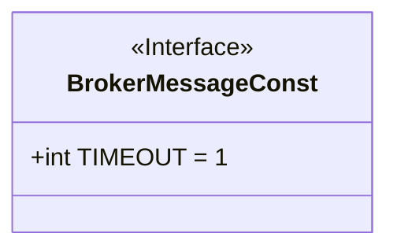
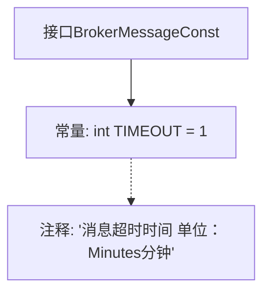

# 基础信息

|      |      |
|------|------|
| 名称 | BrokerMessageConst |
| 编码语言 | .java |
| 代码路径 | rabbit-parent/rabbit-core-producer/src/main/java/com/itihub/rabbit/producer/constant/BrokerMessageConst.java |
| 包名 | com.itihub.rabbit.producer.constant |
| 依赖项 | [] |
| 概述说明 | 接口定义消息超时时间为1分钟。 |

# 说明

该代码定义了一个名为BrokerMessageConst的公共接口，其中包含一个静态常量TIMEOUT，表示消息超时时间，单位为分钟，默认值为1。该接口用于配置消息相关的常量参数。

# 类列表 Class Summary

| 名称   | 类型  | 说明 |
|-------|------|-------------|
| BrokerMessageConst | interface | 接口定义消息超时时间为1分钟。 |

## 类 BrokerMessageConst

|      |      |
|------|------|
| 访问范围 | public |
| 类型 | interface |
| 名称 | BrokerMessageConst |
| 说明 | 接口定义消息超时时间为1分钟。 |

### UML类图

这段代码定义了一个名为`BrokerMessageConst`的接口，其中包含一个公共静态常量`TIMEOUT`，其值为1，表示消息的超时时间（单位为分钟）。接口通过`<<Interface>>`标记明确标识，常量使用大写命名规范，符合Java接口中定义常量的典型用法。该接口可能用于消息中间件系统中统一管理超时配置，其他类可通过实现或引用此接口来获取超时阈值。

### 内部方法调用关系图

该流程图描述了BrokerMessageConst接口的结构，包含一个整型常量TIMEOUT及其注释说明。常量值为1，注释明确标注时间单位为分钟。接口作为纯定义层，不涉及方法实现，仅通过常量提供消息超时的基础配置值，适用于需要统一控制消息生命周期的场景。

### 字段列表 Field List

| 名称  | 类型  | 说明 |
|-------|-------|------|

### 方法列表 Method List

| 名称  | 类型  | 说明 |
|-------|-------|------|

