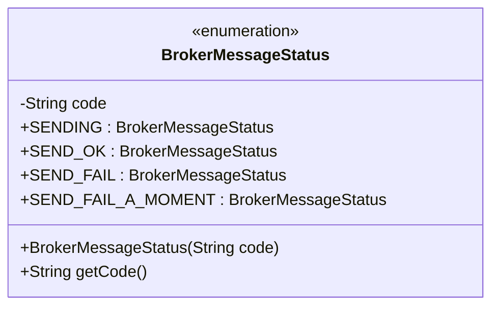
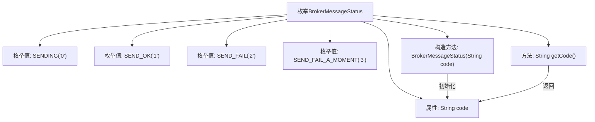

# 基础信息

|      |      |
|------|------|
| 名称 | BrokerMessageStatus |
| 编码语言 | .java |
| 代码路径 | rabbit-parent/rabbit-core-producer/src/main/java/com/itihub/rabbit/producer/constant/BrokerMessageStatus.java |
| 包名 | com.itihub.rabbit.producer.constant |
| 依赖项 | [] |
| 概述说明 | Broker消息状态枚举：发送中(0)、成功(1)、失败(2)、短暂失败(3)。 |

# 说明

这是一个名为BrokerMessageStatus的公共枚举类，定义了四种消息状态：SENDING（发送中，代码"0"）、SEND_OK（发送成功，代码"1"）、SEND_FAIL（发送失败，代码"2"）和SEND_FAIL_A_MOMENT（暂时发送失败，代码"3"）。每个枚举值都通过构造函数关联一个字符串代码，并提供了getCode方法获取代码值。

# 类列表 Class Summary

| 名称   | 类型  | 说明 |
|-------|------|-------------|
| BrokerMessageStatus | enum | Broker消息状态枚举：发送中0，成功1，失败2，短暂失败3。 |

## 类 BrokerMessageStatus

|      |      |
|------|------|
| 访问范围 | public |
| 类型 | enum |
| 名称 | BrokerMessageStatus |
| 说明 | Broker消息状态枚举：发送中0，成功1，失败2，短暂失败3。 |

### UML类图

该枚举类定义了消息代理状态码，包含四种状态常量(SENDING/SEND_OK/SEND_FAIL/SEND_FAIL_A_MOMENT)，每个状态对应一个字符串编码。通过私有构造器强制状态码初始化，并提供getCode()方法获取编码值。枚举类型适用于固定状态集合的场景，确保类型安全并避免无效状态。状态码设计便于系统间状态传递和日志记录，特别适合消息中间件的状态跟踪场景。

### 内部方法调用关系图

该流程图展示了BrokerMessageStatus枚举的结构，包含四个预定义状态常量（SENDING、SEND_OK等），每个常量通过构造方法绑定特定编码值。枚举类包含私有字符串字段code、带参构造方法以及获取编码的getCode方法，构造方法负责初始化枚举实例的code值，getCode方法用于外部访问该值。

### 字段列表 Field List

| 名称  | 类型  | 说明 |
|-------|-------|------|

### 方法列表 Method List

| 名称  | 类型  | 说明 |
|-------|-------|------|

