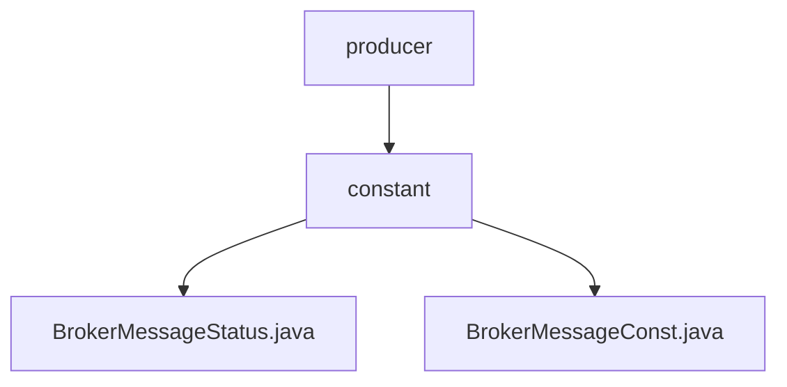

# 基础信息

|      |      |
|------|------|
| 名称 | constant |
| 编码语言 | .java |
| 代码路径 | rabbit-parent/rabbit-core-producer/src/main/java/com/itihub/rabbit/producer/constant |
| 包名 | rabbit-parent.docs.rabbit-core-producer.src.main.java.com.itihub.rabbit.producer.constant |
| 概述说明 | BrokerMessageStatus枚举定义四种消息状态及代码。BrokerMessageConst接口包含超时常量1分钟。 |

# 说明

## 概述  
该代码模块属于消息队列生产者（rabbit-core-producer）的核心组件，主要定义了消息状态枚举和消息相关常量，用于标准化消息的生命周期管理和配置。  

## 主要业务场景  
1. **消息状态管理**  
   - 通过`BrokerMessageStatus`枚举类明确消息的四种状态：  
     - `SENDING`（发送中）  
     - `SEND_OK`（发送成功）  
     - `SEND_FAIL`（发送失败）  
     - `SEND_FAIL_A_MOMENT`（暂时发送失败）  
   - 每种状态关联字符串代码（如`"0"`、`"1"`），便于日志记录或持久化存储时标识状态。  

2. **消息超时配置**  
   - `BrokerMessageConst`接口定义了默认消息超时时间（`TIMEOUT`为1分钟），用于控制消息发送的时效性，避免长时间未处理的消息占用资源。  

3. **标准化扩展**  
   - 枚举和常量接口的设计便于统一维护消息状态流转逻辑和超时策略，适用于以下场景：  
     - 消息发送失败后的重试机制（如根据`SEND_FAIL_A_MOMENT`状态触发延迟重试）。  
     - 监控系统通过状态码统计消息成功率或失败率。  
     - 动态调整超时时间（通过修改`BrokerMessageConst.TIMEOUT`的值）。

### 包内部结构视图

该流程图展示了rabbit-core-producer模块中constant包及其包含的两个Java文件的层级关系。顶层节点producer下包含constant子节点，constant下又包含BrokerMessageStatus.java和BrokerMessageConst.java两个文件节点，清晰地呈现了项目结构中消息生产者模块的常量定义部分。

# 文件列表 File List

| 名称   | 类型  | 说明 |
|-------|------|-------------|
| [BrokerMessageConst.java](BrokerMessageConst.md) | file | 接口定义消息超时时间为1分钟。 |
| [BrokerMessageStatus.java](BrokerMessageStatus.md) | file | Broker消息状态枚举：发送中(0)、成功(1)、失败(2)、短暂失败(3)。 |

