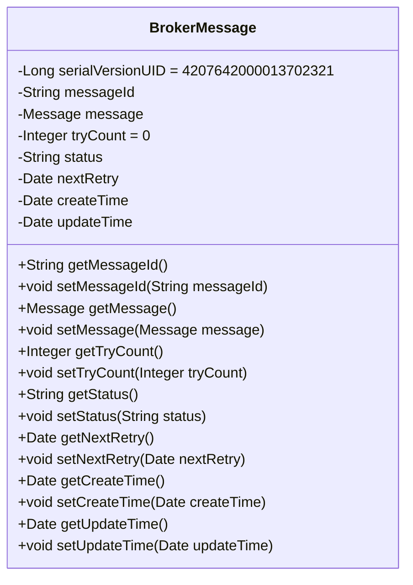
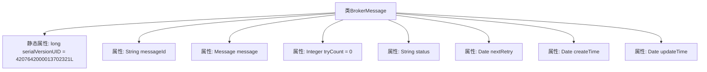

# 基础信息

|      |      |
|------|------|
| 名称 | BrokerMessage |
| 编码语言 | .java |
| 代码路径 | rabbit-parent/rabbit-core-producer/src/main/java/com/itihub/rabbit/producer/entity/BrokerMessage.java |
| 包名 | com.itihub.rabbit.producer.entity |
| 依赖项 | ['com.itihub.rabbit.api.Message', 'lombok.Data', 'java.io.Serializable', 'java.util.Date'] |
| 概述说明 | BrokerMessage类包含消息ID、内容、重试次数、状态、下次重试及创建更新时间。 |

# 说明

BrokerMessage类是一个实现了Serializable接口的Java类，用于表示消息代理中的消息信息。该类包含以下字段：messageId表示消息唯一标识，message存储消息内容，tryCount记录重试次数默认为0，status表示消息状态，nextRetry记录下次重试时间，createTime和updateTime分别记录创建和更新时间。serialVersionUID用于序列化版本控制。

# 类列表 Class Summary

| 名称   | 类型  | 说明 |
|-------|------|-------------|
| BrokerMessage | class | BrokerMessage类包含消息ID、内容、重试次数、状态、下次重试及创建更新时间。 |

## 类 BrokerMessage

|      |      |
|------|------|
| 访问范围 | @Data;public |
| 类型 | class |
| 名称 | BrokerMessage |
| 说明 | BrokerMessage类包含消息ID、内容、重试次数、状态、下次重试及创建更新时间。 |

### UML类图

该代码定义了一个可序列化的BrokerMessage类，用于封装消息代理系统中的消息元数据。类包含消息ID、消息体、重试次数、状态、下次重试时间等核心字段，并通过Lombok的@Data注解自动生成getter/setter方法。所有字段均为私有属性，通过公有方法进行访问控制，适用于需要持久化或网络传输的消息处理场景。

### 内部方法调用关系图

这段代码定义了一个名为BrokerMessage的可序列化Java类，包含7个核心属性和1个静态序列化标识符。类结构采用Lombok的@Data注解自动生成getter/setter等方法，主要属性包括消息ID、消息体、重试计数器、状态标志以及四个时间戳字段（下次重试时间、创建时间和更新时间）。静态serialVersionUID用于控制序列化版本兼容性，而tryCount默认初始化为0，体现消息重试机制的基础设计。

### 字段列表 Field List

| 名称  | 类型  | 说明 |
|-------|-------|------|
| status | String | 私有字符串变量status |
| serialVersionUID = 4207642000013702321L | long | 私有静态长整型序列化ID |
| message | Message | 私有消息对象 |
| messageId | String | 私有字符串变量messageId |
| tryCount = 0 | Integer | 私有整型变量tryCount初始化为0。 |
| nextRetry | Date | 私有日期类型变量nextRetry |
| createTime | Date | 私有日期创建时间 |
| updateTime | Date | 私有日期类型变量updateTime |

### 方法列表 Method List

| 名称  | 类型  | 说明 |
|-------|-------|------|

