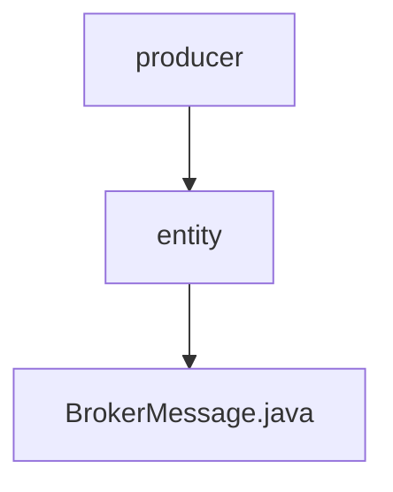

# 基础信息

|      |      |
|------|------|
| 名称 | entity |
| 编码语言 | .java |
| 代码路径 | rabbit-parent/rabbit-core-producer/src/main/java/com/itihub/rabbit/producer/entity |
| 包名 | rabbit-parent.docs.rabbit-core-producer.src.main.java.com.itihub.rabbit.producer.entity |
| 概述说明 | BrokerMessage类包含消息ID、内容、重试次数、状态、下次重试及创建更新时间。 |

# 说明

BrokerMessage类是一个实现了Serializable接口的Java类，用于表示消息代理中的消息信息。该类包含以下字段：messageId表示消息唯一标识，message存储消息内容，tryCount记录重试次数默认为0，status表示消息状态，nextRetry记录下次重试时间，createTime和updateTime分别记录创建和更新时间。serialVersionUID用于序列化版本控制。

### 包内部结构视图

该流程图展示了rabbit-core-producer模块中的核心生产者实体类结构。顶层节点为producer，其下包含entity子目录，该子目录中包含BrokerMessage.java实体类文件。这是一个典型的Java项目分层结构，体现了生产者模块中消息代理相关实体的组织方式。

# 文件列表 File List

| 名称   | 类型  | 说明 |
|-------|------|-------------|
| [BrokerMessage.java](BrokerMessage.md) | file | BrokerMessage类包含消息ID、内容、重试次数、状态、下次重试及创建更新时间。 |

