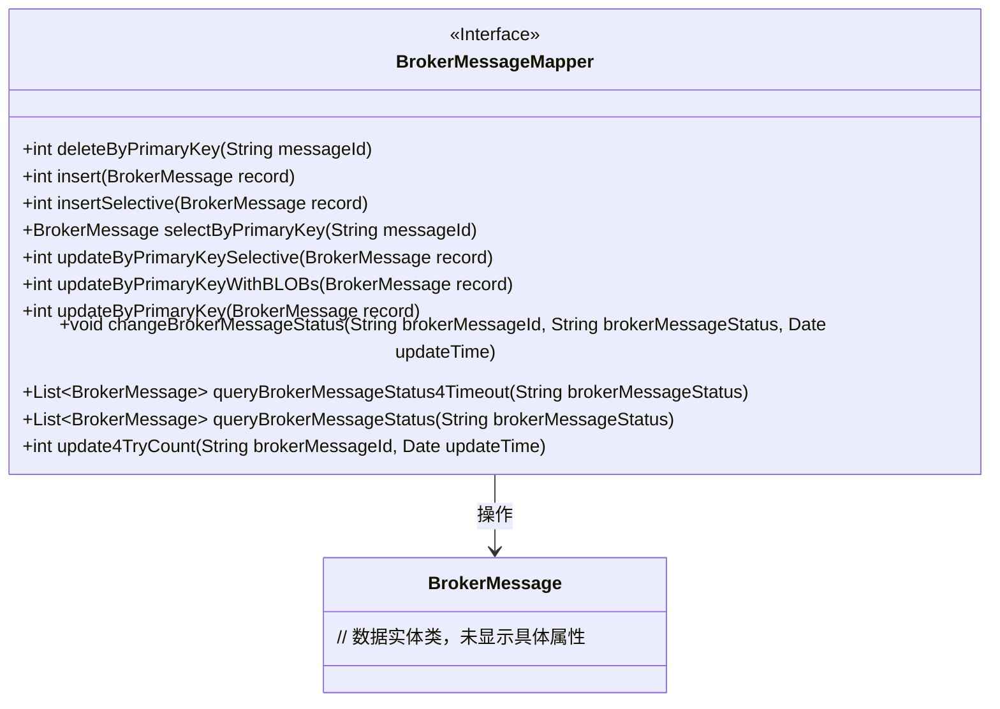

# 基础信息

|      |      |
|------|------|
| 名称 | BrokerMessageMapper |
| 编码语言 | .java |
| 代码路径 | rabbit-parent/rabbit-core-producer/src/main/java/com/itihub/rabbit/producer/mapper/BrokerMessageMapper.java |
| 包名 | com.itihub.rabbit.producer.mapper |
| 依赖项 | ['com.itihub.rabbit.producer.entity.BrokerMessage', 'org.apache.ibatis.annotations.Mapper', 'org.apache.ibatis.annotations.Param', 'java.util.Date', 'java.util.List'] |
| 概述说明 | Broker消息映射接口，含增删改查及状态变更方法。 |

# 说明

该接口定义了消息代理的数据访问操作，包含基本CRUD功能：按主键删除、插入完整记录、选择性插入、按主键查询、选择性更新、带大字段更新和全字段更新。扩展功能包括修改消息状态、查询超时消息、按状态筛选消息、更新重试次数和更新时间。所有方法均围绕BrokerMessage对象和状态管理设计，支持参数化查询。

# 类列表 Class Summary

| 名称   | 类型  | 说明 |
|-------|------|-------------|
| BrokerMessageMapper | interface | Broker消息映射接口，含增删改查及状态变更方法。 |

## 类 BrokerMessageMapper

|      |      |
|------|------|
| 访问范围 | public |
| 类型 | interface |
| 名称 | BrokerMessageMapper |
| 说明 | Broker消息映射接口，含增删改查及状态变更方法。 |

### UML类图

类图描述：该图展示了一个消息代理映射接口BrokerMessageMapper及其关联的数据实体类BrokerMessage。接口定义了完整的CRUD操作方法，包括按主键删除/查询、选择性插入/更新、带BLOB字段的更新等核心操作，同时包含状态变更、超时状态查询和重试计数更新等业务方法。所有方法均围绕BrokerMessage实体进行操作，体现了数据访问层的典型设计模式。

### 内部方法调用关系图

```mermaid
graph TD
    A["接口BrokerMessageMapper"]
    B["方法: int deleteByPrimaryKey(String messageId)"]
    C["方法: int insert(BrokerMessage record)"]
    D["方法: int insertSelective(BrokerMessage record)"]
    E["方法: BrokerMessage selectByPrimaryKey(String messageId)"]
    F["方法: int updateByPrimaryKeySelective(BrokerMessage record)"]
    G["方法: int updateByPrimaryKeyWithBLOBs(BrokerMessage record)"]
    H["方法: int updateByPrimaryKey(BrokerMessage record)"]
    I["方法: changeBrokerMessageStatus(String brokerMessageId, String brokerMessageStatus, Date updateTime)"]
    J["方法: List<BrokerMessage> queryBrokerMessageStatus4Timeout(String brokerMessageStatus)"]
    K["方法: List<BrokerMessage> queryBrokerMessageStatus(String brokerMessageStatus)"]
    L["方法: int update4TryCount(String brokerMessageId, Date updateTime)"]

    A --> B
    A --> C
    A --> D
    A --> E
    A --> F
    A --> G
    A --> H
    A --> I
    A --> J
    A --> K
    A --> L
```

该流程图展示了BrokerMessageMapper接口的所有方法定义。接口主要提供对BrokerMessage记录的CRUD操作，包括按主键删除、插入（全字段/可选字段）、查询、更新（全字段/可选字段/含BLOB字段）等基础操作。同时包含状态变更、超时状态查询和重试计数更新等业务方法，完整描述了消息代理模块的数据访问层契约。所有方法均围绕消息ID或状态进行数据操作，适用于分布式消息处理场景。

### 字段列表 Field List

| 名称  | 类型  | 说明 |
|-------|-------|------|

### 方法列表 Method List

| 名称  | 类型  | 说明 |
|-------|-------|------|
| selectByPrimaryKey | BrokerMessage | 根据主键messageId查询BrokerMessage |
| updateByPrimaryKeyWithBLOBs | int | 更新包含BLOB字段的主键记录 |
| deleteByPrimaryKey | int | 删除指定主键消息 |
| queryBrokerMessageStatus4Timeout | List<BrokerMessage> | 查询指定状态的超时代理消息列表。 |
| updateByPrimaryKeySelective | int | 更新BrokerMessage记录的部分字段。 |
| insert | int | 插入BrokerMessage记录的方法。 |
| updateByPrimaryKey | int | 更新主键对应的BrokerMessage记录。 |
| insertSelective | int | 插入BrokerMessage记录，选择性字段非空时插入。 |
| changeBrokerMessageStatus | void | 更新消息状态：ID、状态、时间。 |
| queryBrokerMessageStatus | List<BrokerMessage> | 查询指定状态的Broker消息列表。 |
| update4TryCount | int | 更新消息重试次数，参数为消息ID和更新时间。 |

