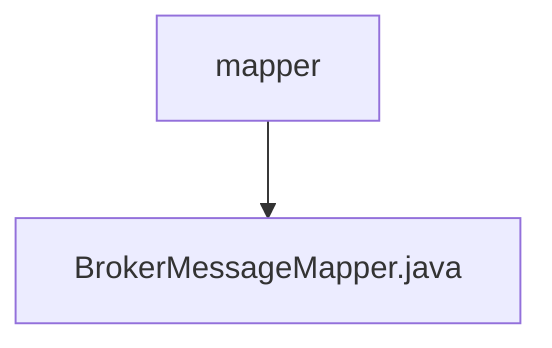

# 基础信息

|      |      |
|------|------|
| 名称 | mapper |
| 编码语言 | .java |
| 代码路径 | rabbit-parent/rabbit-core-producer/src/main/java/com/itihub/rabbit/producer/mapper |
| 包名 | rabbit-parent.docs.rabbit-core-producer.src.main.java.com.itihub.rabbit.producer.mapper |
| 概述说明 | Broker消息映射接口，含增删改查及状态变更方法。 |

# 说明

该接口定义了消息代理的数据访问操作，包含基本CRUD功能：按主键删除、插入完整记录、选择性插入、按主键查询、选择性更新、带大字段更新和全字段更新。扩展功能包括修改消息状态、查询超时消息、按状态筛选消息、更新重试次数和更新时间。所有方法均围绕BrokerMessage对象和状态管理设计，支持参数化查询。

### 包内部结构视图

该流程图展示了rabbit-core-producer项目中mapper目录的层级结构。顶层节点为mapper目录，其下包含一个Java文件BrokerMessageMapper.java。这个结构清晰地反映了消息生产者模块中数据访问层的简单组织结构，mapper目录专门存放与消息代理相关的数据映射接口或类。

# 文件列表 File List

| 名称   | 类型  | 说明 |
|-------|------|-------------|
| [BrokerMessageMapper.java](BrokerMessageMapper.md) | file | Broker消息映射接口，含增删改查及状态变更方法。 |

