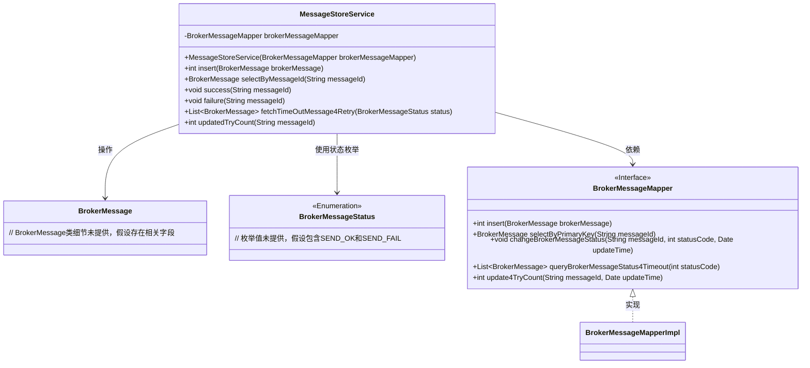
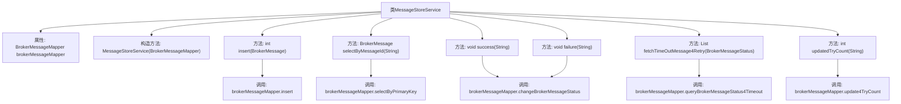

# 基础信息

|      |      |
|------|------|
| 名称 | MessageStoreService |
| 编码语言 | .java |
| 代码路径 | rabbit-parent/rabbit-core-producer/src/main/java/com/itihub/rabbit/producer/service/MessageStoreService.java |
| 包名 | com.itihub.rabbit.producer.service |
| 依赖项 | ['com.itihub.rabbit.producer.constant.BrokerMessageStatus', 'com.itihub.rabbit.producer.entity.BrokerMessage', 'com.itihub.rabbit.producer.mapper.BrokerMessageMapper', 'org.springframework.beans.factory.annotation.Autowired', 'org.springframework.stereotype.Service', 'java.util.Date', 'java.util.List'] |
| 概述说明 | 消息存储服务类，包含插入、查询、状态更新和重试计数功能。 |

# 说明

MessageStoreService是一个消息存储服务类，依赖BrokerMessageMapper进行数据库操作。主要功能包括：插入消息记录、根据消息ID查询消息、标记消息为成功或失败状态、获取超时重试消息列表、更新消息重试次数。所有操作均通过调用BrokerMessageMapper的对应方法实现，涉及状态变更时会记录当前时间。

# 类列表 Class Summary

| 名称   | 类型  | 说明 |
|-------|------|-------------|
| MessageStoreService | class | 消息存储服务类，包含插入、查询、状态更新及超时消息重试功能。 |

## 类 MessageStoreService

|      |      |
|------|------|
| 访问范围 | public |
| 类型 | class |
| 名称 | MessageStoreService |
| 说明 | 消息存储服务类，包含插入、查询、状态更新及超时消息重试功能。 |

### UML类图

类图描述：该图展示了MessageStoreService与BrokerMessageMapper接口及其实现类的关系。MessageStoreService通过依赖注入BrokerMessageMapper来操作BrokerMessage对象，使用BrokerMessageStatus枚举管理消息状态。核心功能包括消息CRUD操作、状态变更（成功/失败）、超时消息重试查询和重试计数更新，体现了消息存储服务的核心职责。

### 内部方法调用关系图

该流程图展示了MessageStoreService类的结构和功能，包含1个构造方法和5个核心业务方法。所有方法都通过brokerMessageMapper属性与数据库交互，实现消息的CRUD操作和状态管理。其中success()和failure()方法共享状态变更逻辑，fetchTimeOutMessage4Retry()处理超时消息查询，updatedTryCount()更新重试次数。类设计遵循单一职责原则，每个方法对应明确的消息处理场景。

### 字段列表 Field List

| 名称  | 类型  | 说明 |
|-------|-------|------|
| brokerMessageMapper | BrokerMessageMapper | 私有BrokerMessageMapper变量brokerMessageMapper |

### 方法列表 Method List

| 名称  | 类型  | 说明 |
|-------|-------|------|
| success | void | 方法success更新消息状态为发送成功，记录当前时间。 |
| selectByMessageId | BrokerMessage | 根据消息ID查询BrokerMessage信息。 |
| failure | void | 方法failure更新消息状态为发送失败，记录当前时间。 |
| insert | int | 插入BrokerMessage并返回结果。 |
| fetchTimeOutMessage4Retry | List<BrokerMessage> | 从数据库查询超时消息列表，按状态筛选。 |
| updatedTryCount | int | 更新消息重试次数并返回结果。 |

