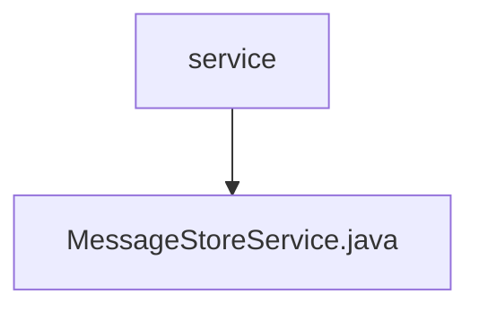

# 基础信息

|      |      |
|------|------|
| 名称 | service |
| 编码语言 | .java |
| 代码路径 | rabbit-parent/rabbit-core-producer/src/main/java/com/itihub/rabbit/producer/service |
| 包名 | rabbit-parent.docs.rabbit-core-producer.src.main.java.com.itihub.rabbit.producer.service |
| 概述说明 | 消息存储服务类，包含插入、查询、状态更新和重试计数功能。 |

# 说明

MessageStoreService是一个消息存储服务类，依赖BrokerMessageMapper进行数据库操作。主要功能包括：插入消息记录、根据消息ID查询消息、标记消息为成功或失败状态、获取超时重试消息列表、更新消息重试次数。所有操作均通过调用BrokerMessageMapper的对应方法实现，涉及状态变更时会记录当前时间。

### 包内部结构视图

该流程图展示了rabbit-core-producer模块中service包与MessageStoreService.java文件的层级关系。顶层节点为service目录，其下级包含一个具体的服务实现类MessageStoreService.java。这种结构是典型的生产者服务模块设计，其中核心服务类被组织在统一的service包下，便于维护和调用。

# 文件列表 File List

| 名称   | 类型  | 说明 |
|-------|------|-------------|
| [MessageStoreService.java](MessageStoreService.md) | file | 消息存储服务类，包含插入、查询、状态更新和重试计数功能。 |

