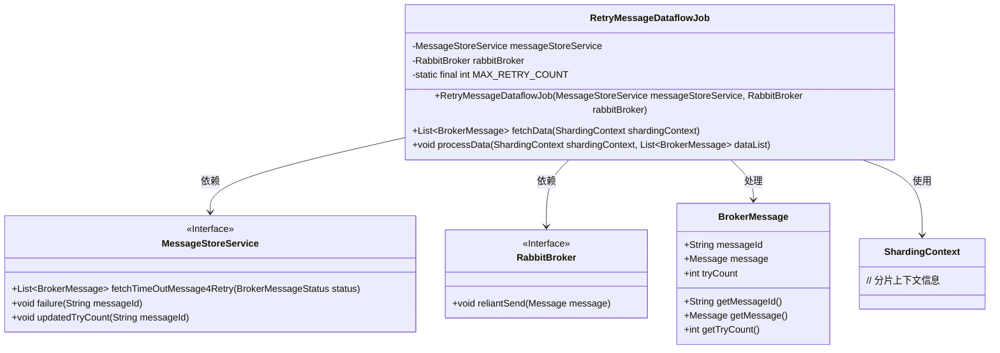
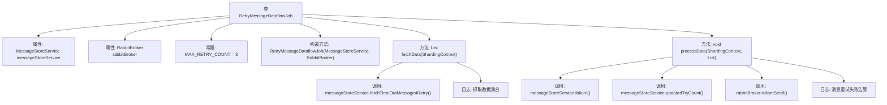

# 基础信息

|      |      |
|------|------|
| 名称 | RetryMessageDataflowJob |
| 编码语言 | .java |
| 代码路径 | rabbit-parent/rabbit-core-producer/src/main/java/com/itihub/rabbit/producer/task/RetryMessageDataflowJob.java |
| 包名 | com.itihub.rabbit.producer.task |
| 依赖项 | ['com.dangdang.ddframe.job.api.ShardingContext', 'com.dangdang.ddframe.job.api.dataflow.DataflowJob', 'com.itihub.rabbit.producer.broker.RabbitBroker', 'com.itihub.rabbit.producer.constant.BrokerMessageStatus', 'com.itihub.rabbit.producer.entity.BrokerMessage', 'com.itihub.rabbit.producer.service.MessageStoreService', 'com.itihub.rabbit.task.annotaion.ElasticJobConfig', 'com.itihub.rabbit.task.annotaion.JobCoreConfiguration', 'com.itihub.rabbit.task.annotaion.LiteJobConfiguration', 'lombok.extern.slf4j.Slf4j', 'org.springframework.beans.factory.annotation.Autowired', 'org.springframework.stereotype.Component', 'java.util.List'] |
| 概述说明 | 定时任务补偿投递消息，最多重试3次，失败记录日志。 |

# 说明

该代码定义了一个名为RetryMessageDataflowJob的弹性作业类，用于处理可靠性投递消息的补偿任务。作业每10秒执行一次，单分片运行。类中注入了MessageStoreService和RabbitBroker服务，用于数据存取和消息投递。fetchData方法获取状态为SENDING的超时消息列表，processData方法处理这些消息：若重试次数超过3次则标记为失败，否则更新重试计数并重新投递消息。整个过程通过日志记录关键操作状态。

# 类列表 Class Summary

| 名称   | 类型  | 说明 |
|-------|------|-------------|
| RetryMessageDataflowJob | class | 定时任务补偿投递消息，每10秒执行一次，最多重试3次。 |

## 类 RetryMessageDataflowJob

|      |      |
|------|------|
| 访问范围 | @Slf4j;@ElasticJobConfig(;        coreConfig = @JobCoreConfiguration(;            name = "com.itihub.rabbit.producer.task.RetryMessageDataflowJob",;            cron = "0/10 * * * * ?",;            description = "可靠性投递消息补偿任务",;            shardingTotalCount = 1;        ),;        liteJobConfig = @LiteJobConfiguration(overwrite = true);;);public |
| 类型 | class |
| 名称 | RetryMessageDataflowJob |
| 说明 | 定时任务补偿投递消息，每10秒执行一次，最多重试3次。 |

### UML类图

该代码实现了一个基于ElasticJob的可靠性消息重试补偿任务。RetryMessageDataflowJob类通过定时任务（每10秒执行）从MessageStoreService获取超时未确认的消息，并通过RabbitBroker进行重试投递。当消息重试次数超过最大限制（3次）时标记为失败，否则更新重试计数并继续投递。类图展示了核心组件及其依赖关系，包括数据存储服务、消息代理接口和消息实体类。

### 内部方法调用关系图

该流程图展示了RetryMessageDataflowJob类的核心结构和执行逻辑。该类是一个ElasticJob定时任务，主要功能是处理消息重投递的补偿机制。通过fetchData方法获取待重试消息列表，processData方法实现消息重试逻辑：当重试次数超限时标记为失败，否则更新重试计数并重新投递。整个流程涉及消息存储服务和RabbitMQ代理的交互，并包含关键日志点用于监控。

### 字段列表 Field List

| 名称  | 类型  | 说明 |
|-------|-------|------|
| messageStoreService | MessageStoreService | 私有消息存储服务实例。 |
| MAX_RETRY_COUNT = 3 | int | 私有常量，最大重试次数为3。 |
| rabbitBroker | RabbitBroker | 私有RabbitMQ代理实例 |

### 方法列表 Method List

| 名称  | 类型  | 说明 |
|-------|-------|------|
| processData | void | 处理消息重试逻辑：超最大次数标记失败，否则更新计数并重发。 |
| fetchData | List<BrokerMessage> | 重写fetchData方法，获取超时消息列表并返回。 |

