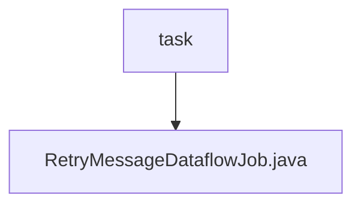

# 基础信息

|      |      |
|------|------|
| 名称 | task |
| 编码语言 | .java |
| 代码路径 | rabbit-parent/rabbit-core-producer/src/main/java/com/itihub/rabbit/producer/task |
| 包名 | rabbit-parent.docs.rabbit-core-producer.src.main.java.com.itihub.rabbit.producer.task |
| 概述说明 | 定时任务补偿投递消息，最多重试3次，失败记录日志。 |

# 说明

该代码定义了一个名为RetryMessageDataflowJob的弹性作业类，用于处理可靠性投递消息的补偿任务。作业每10秒执行一次，单分片运行。类中注入了MessageStoreService和RabbitBroker服务，用于数据存取和消息投递。fetchData方法获取状态为SENDING的超时消息列表，processData方法处理这些消息：若重试次数超过3次则标记为失败，否则更新重试计数并重新投递消息。整个过程通过日志记录关键操作状态。

### 包内部结构视图

该流程图展示了rabbit-core-producer模块中任务目录的层级结构。顶层节点为task文件夹，其下包含一个Java文件RetryMessageDataflowJob.java，表示这是一个实现消息重试功能的数据流任务类。这种结构符合生产者模块中任务处理组件的典型代码组织方式。

# 文件列表 File List

| 名称   | 类型  | 说明 |
|-------|------|-------------|
| [RetryMessageDataflowJob.java](RetryMessageDataflowJob.md) | file | 定时任务补偿投递消息，最多重试3次，失败记录日志。 |

