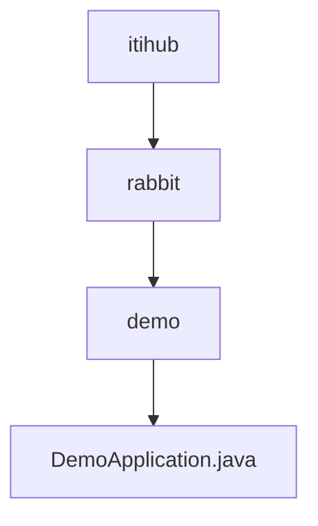

# 基础信息

|      |      |
|------|------|
| 名称 | itihub |
| 编码语言 | .java |
| 代码路径 | rabbit-parent/rabbit-demo/src/main/java/com/itihub |
| 包名 | rabbit-parent.docs.rabbit-demo.src.main.java.com.itihub |
| 概述说明 | SpringBoot应用启动类，包含主方法运行应用。 |

# 说明

这是一个使用Spring Boot框架的Java应用程序入口类。类名为DemoApplication，标注了@SpringBootApplication注解，表明这是一个Spring Boot应用的主配置类。main方法作为程序启动入口，通过SpringApplication.run方法启动整个Spring Boot应用，传入当前类对象和命令行参数args。该结构是标准Spring Boot应用的启动模板，负责初始化应用上下文和自动配置组件。

### 包内部结构视图

该流程图展示了RabbitMQ演示项目的Java包结构层级关系。从根包com.itihub开始，依次包含rabbit子包，rabbit下又包含demo子包，最终在demo包中包含DemoApplication.java主应用文件。这种层级结构是典型的Spring Boot项目包组织方式，符合领域驱动的包设计原则。

# 文件列表 File List

| 名称   | 类型  | 说明 |
|-------|------|-------------|
| [rabbit](rabbit/_module.md) | package | SpringBoot应用启动类，包含主方法运行应用。 |

