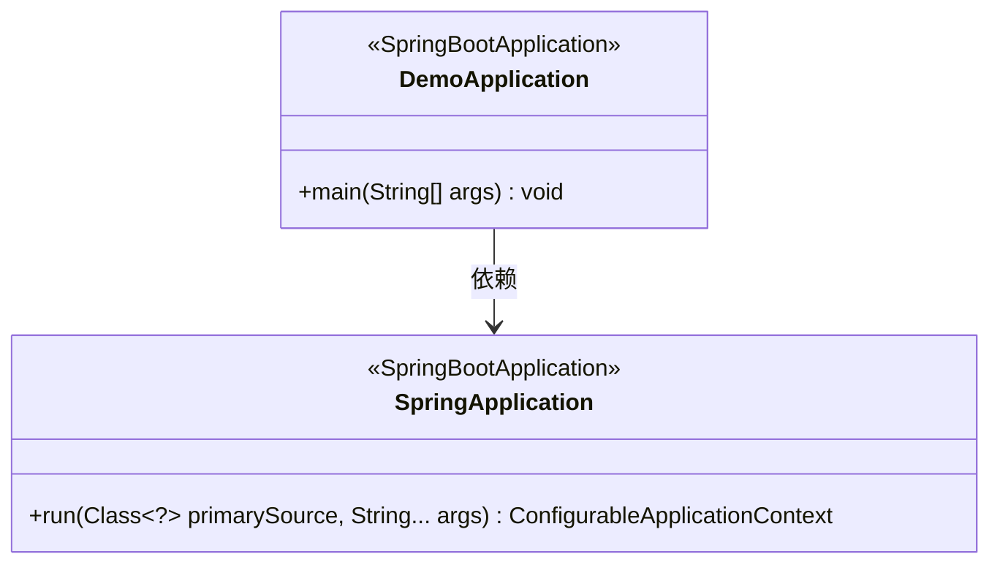
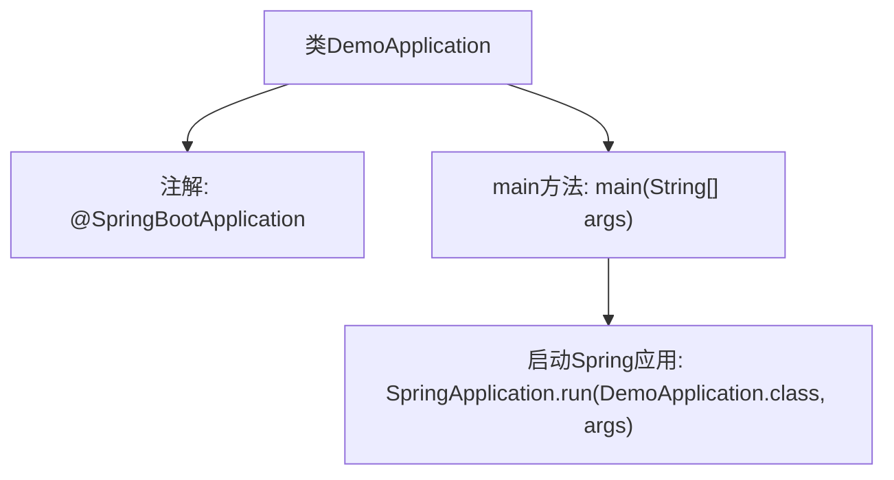

# 基础信息

|      |      |
|------|------|
| 名称 | DemoApplication |
| 编码语言 | .java |
| 代码路径 | rabbit-parent/rabbit-demo/src/main/java/com/itihub/rabbit/demo/DemoApplication.java |
| 包名 | com.itihub.rabbit.demo |
| 依赖项 | ['org.springframework.boot.SpringApplication', 'org.springframework.boot.autoconfigure.SpringBootApplication'] |
| 概述说明 | SpringBoot应用启动类，包含主方法运行应用。 |

# 说明

这是一个使用Spring Boot框架的Java应用程序入口类。类名为DemoApplication，标注了@SpringBootApplication注解，表明这是一个Spring Boot应用的主配置类。main方法作为程序启动入口，通过SpringApplication.run方法启动整个Spring Boot应用，传入当前类对象和命令行参数args。该结构是标准Spring Boot应用的启动模板，负责初始化应用上下文和自动配置组件。

# 类列表 Class Summary

| 名称   | 类型  | 说明 |
|-------|------|-------------|
| DemoApplication | class | SpringBoot应用启动类，包含主方法运行应用。 |

## 类 DemoApplication

|      |      |
|------|------|
| 访问范围 | @SpringBootApplication;public |
| 类型 | class |
| 名称 | DemoApplication |
| 说明 | SpringBoot应用启动类，包含主方法运行应用。 |

### UML类图

这段类图描述了一个基础的Spring Boot应用启动类DemoApplication，它被标记为@SpringBootApplication注解，包含一个静态main方法作为程序入口。该类依赖于SpringApplication类，通过调用其run方法来启动Spring应用上下文。SpringApplication类提供了核心的运行方法，接受主配置类和命令行参数作为输入，返回可配置的应用上下文对象。整个结构展示了Spring Boot应用的标准启动流程和核心组件关系。

### 内部方法调用关系图

该流程图展示了Spring Boot应用的启动过程。DemoApplication类通过@SpringBootApplication注解标记为Spring Boot应用入口，main方法作为程序起点调用SpringApplication.run()方法，该方法会初始化Spring容器、加载配置并启动内嵌服务器。整个过程体现了Spring Boot的约定优于配置理念，仅需最简代码即可启动完整应用。

### 字段列表 Field List

| 名称  | 类型  | 说明 |
|-------|-------|------|

### 方法列表 Method List

| 名称  | 类型  | 说明 |
|-------|-------|------|
| main | void | Java Spring Boot应用主入口，启动DemoApplication。 |

