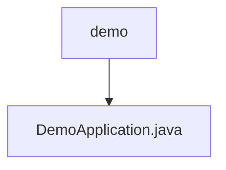

# 基础信息

|      |      |
|------|------|
| 名称 | demo |
| 编码语言 | .java |
| 代码路径 | rabbit-parent/rabbit-demo/src/main/java/com/itihub/rabbit/demo |
| 包名 | rabbit-parent.docs.rabbit-demo.src.main.java.com.itihub.rabbit.demo |
| 概述说明 | SpringBoot应用启动类，包含主方法运行应用。 |

# 说明

这是一个使用Spring Boot框架的Java应用程序入口类。类名为DemoApplication，标注了@SpringBootApplication注解，表明这是一个Spring Boot应用的主配置类。main方法作为程序启动入口，通过SpringApplication.run方法启动整个Spring Boot应用，传入当前类对象和命令行参数args。该结构是标准Spring Boot应用的启动模板，负责初始化应用上下文和自动配置组件。

### 包内部结构视图

该流程图展示了rabbit-demo项目的基本结构，demo作为主目录包含一个核心文件DemoApplication.java。这个结构代表了一个典型的Spring Boot应用入口点配置，其中DemoApplication.java是应用的启动类，位于demo模块的根路径下。整个结构简洁明了，符合基础微服务项目的标准目录布局。

# 文件列表 File List

| 名称   | 类型  | 说明 |
|-------|------|-------------|
| [DemoApplication.java](DemoApplication.md) | file | SpringBoot应用启动类，包含主方法运行应用。 |

