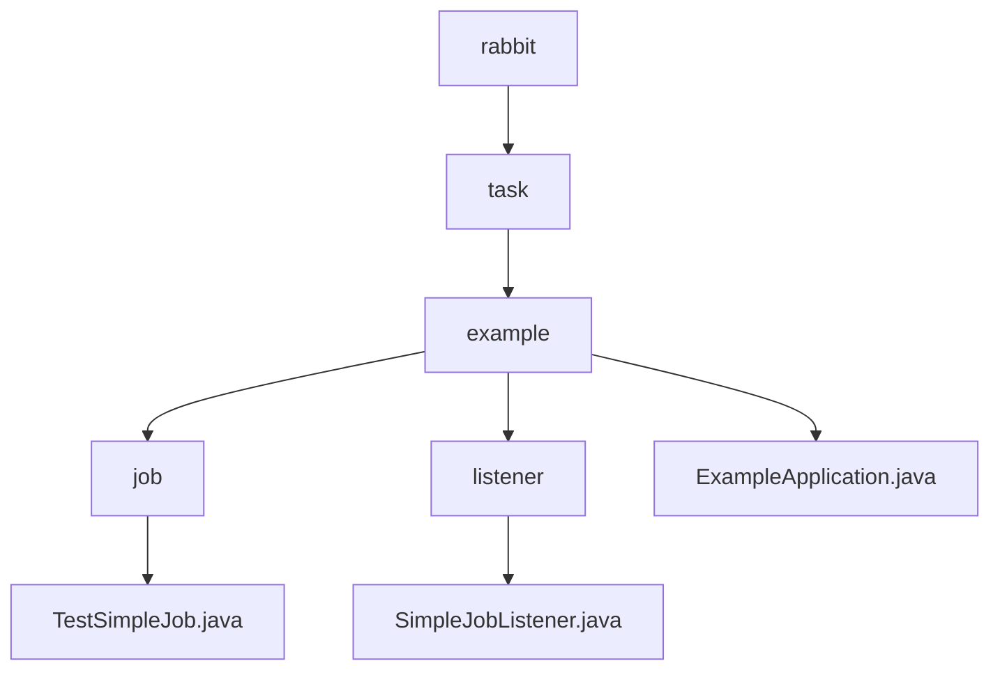

# 基础信息

|      |      |
|------|------|
| 名称 | rabbit |
| 编码语言 | .java |
| 代码路径 | rabbit-parent/rabbit-task-example/src/main/java/com/itihub/rabbit |
| 包名 | rabbit-parent.docs.rabbit-task-example.src.main.java.com.itihub.rabbit |
| 概述说明 | TestSimpleJob作业类配置ElasticJob，5秒执行，2分片，带监听器。SimpleJobListener记录任务前后日志。ExampleApplication是SpringBoot入口。 |

# 说明

## 概述  
该代码模块是一个基于Spring Boot框架的简单分布式任务调度示例，主要使用ElasticJob实现定时任务的配置与执行。模块包含三个核心组件：  
1. **TestSimpleJob**：配置了ElasticJob的简单作业类，定义了任务执行逻辑、分片策略及监听器。  
2. **SimpleJobListener**：实现了ElasticJob的监听器接口，用于在任务执行前后记录分片上下文信息。  
3. **ExampleApplication**：Spring Boot应用入口，当前未完全启用ElasticJob功能，但保留了扩展支持。  

## 主要业务场景  
1. **分布式定时任务执行**：  
   - 通过`TestSimpleJob`实现每5秒触发一次的定时任务，支持分片处理（北京/上海两个分片）和故障转移。  
   - 任务执行时输出日志，并通过监听器记录分片参数（如作业名称、分片ID等）。  

2. **任务生命周期监控**：  
   - `SimpleJobListener`监听任务执行前后事件，以JSON格式输出分片上下文信息，便于调试和状态追踪。  

3. **Spring Boot集成**：  
   - `ExampleApplication`作为应用入口，预留了ElasticJob的启用接口（通过`@EnableElasticJob`注解），可快速扩展为完整的分布式任务调度系统。  

**备注**：当前模块处于基础配置阶段，部分功能（如ElasticJob全局启用）需通过取消注释注解来激活。

### 包内部结构视图

该流程图展示了rabbit模块下的任务示例项目结构，从根目录rabbit开始，依次展开task、example层级，并在example下分为job、listener两个子目录及主程序文件。job目录包含测试任务类，listener目录包含简单任务监听器，整体呈现清晰的树形层级关系。

# 文件列表 File List

| 名称   | 类型  | 说明 |
|-------|------|-------------|
| [task](task/_module.md) | package | TestSimpleJob作业类配置ElasticJob，5秒执行，2分片，带监听器。SimpleJobListener记录任务前后日志。ExampleApplication是SpringBoot入口。 |

