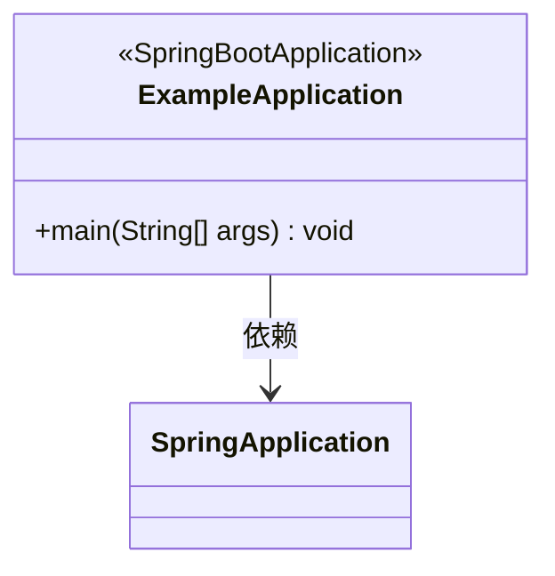
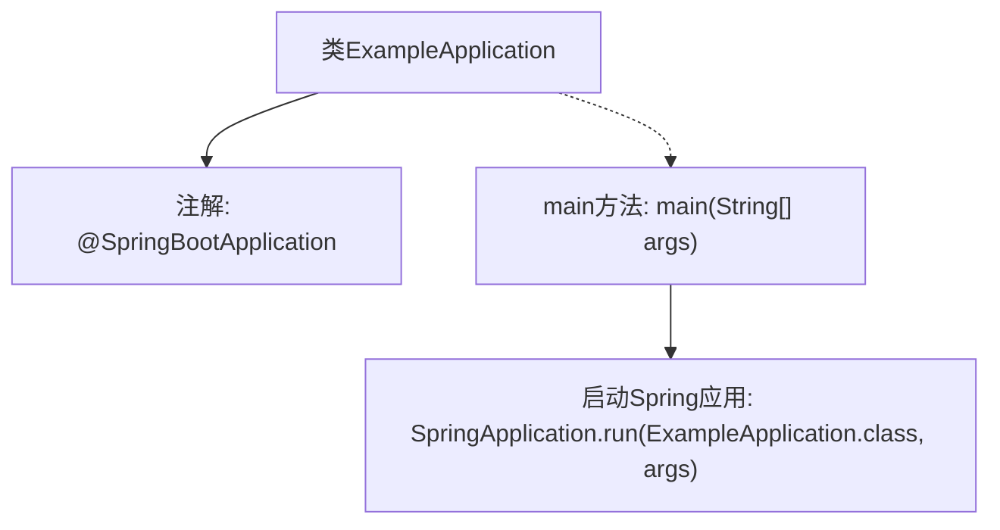

# 基础信息

|      |      |
|------|------|
| 名称 | ExampleApplication |
| 编码语言 | .java |
| 代码路径 | rabbit-parent/rabbit-task-example/src/main/java/com/itihub/rabbit/task/example/ExampleApplication.java |
| 包名 | com.itihub.rabbit.task.example |
| 依赖项 | ['com.itihub.rabbit.task.annotaion.EnableElasticJob', 'org.springframework.boot.SpringApplication', 'org.springframework.boot.autoconfigure.SpringBootApplication', 'org.springframework.context.annotation.ComponentScan'] |
| 概述说明 | SpringBoot应用启动类，含主方法运行入口。 |

# 说明

这是一个基于Spring Boot框架的Java应用程序主类ExampleApplication。类上标注了@SpringBootApplication注解，表明这是一个Spring Boot应用入口。当前注释掉了@EnableElasticJob和@ComponentScan两个注解，说明暂时未启用分布式任务调度功能和对指定包路径的组件扫描。main方法作为程序启动入口，通过SpringApplication.run启动整个Spring Boot应用。整个类结构简洁，符合标准Spring Boot应用的基本配置要求。

# 类列表 Class Summary

| 名称   | 类型  | 说明 |
|-------|------|-------------|
| ExampleApplication | class | SpringBoot应用启动类，含主方法运行入口。 |

## 类 ExampleApplication

|      |      |
|------|------|
| 访问范围 | @SpringBootApplication;//@EnableElasticJob;//@ComponentScan(basePackages = {"com.itihub.rabbit.task.*"});public |
| 类型 | class |
| 名称 | ExampleApplication |
| 说明 | SpringBoot应用启动类，含主方法运行入口。 |

### UML类图

这段代码展示了一个典型的Spring Boot应用启动类。ExampleApplication类被@SpringBootApplication注解标记，表明这是一个Spring Boot应用的主配置类。该类包含一个main方法作为程序入口，通过调用SpringApplication.run()来启动整个Spring应用。类图中清晰地展示了ExampleApplication与SpringApplication框架类之间的依赖关系，体现了Spring Boot应用的基本启动流程。这个简单的结构是Spring Boot应用的核心，负责自动配置、组件扫描和应用上下文初始化。

### 内部方法调用关系图

这段流程图描述了Spring Boot应用的启动过程。ExampleApplication类通过@SpringBootApplication注解标记为主配置类，其main方法作为程序入口调用SpringApplication.run()启动整个Spring应用上下文。该流程展示了从类定义到容器初始化的关键步骤，省略了被注释掉的弹性作业和组件扫描配置，突出了核心启动逻辑。

### 字段列表 Field List

| 名称  | 类型  | 说明 |
|-------|-------|------|

### 方法列表 Method List

| 名称  | 类型  | 说明 |
|-------|-------|------|
| main | void | Java启动Spring应用的main方法。 |

