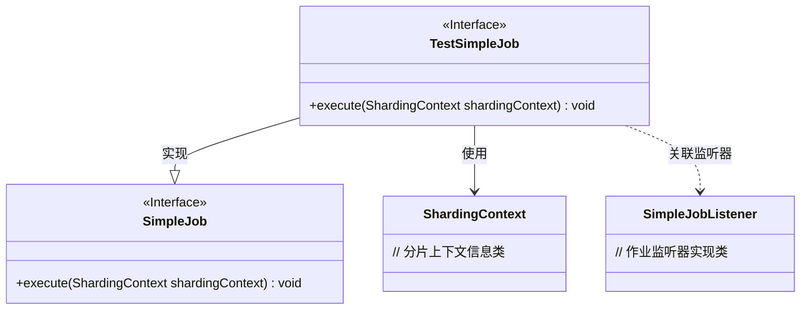
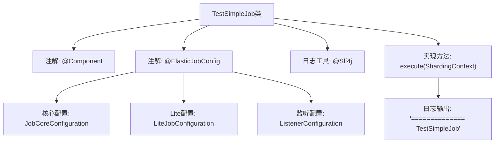

# 基础信息

|      |      |
|------|------|
| 名称 | TestSimpleJob |
| 编码语言 | .java |
| 代码路径 | rabbit-parent/rabbit-task-example/src/main/java/com/itihub/rabbit/task/example/job/TestSimpleJob.java |
| 包名 | com.itihub.rabbit.task.example.job |
| 依赖项 | ['com.dangdang.ddframe.job.api.ShardingContext', 'com.dangdang.ddframe.job.api.simple.SimpleJob', 'com.itihub.rabbit.task.annotaion.ElasticJobConfig', 'com.itihub.rabbit.task.annotaion.JobCoreConfiguration', 'com.itihub.rabbit.task.annotaion.ListenerConfiguration', 'com.itihub.rabbit.task.annotaion.LiteJobConfiguration', 'com.itihub.rabbit.task.example.listener.SimpleJobListener', 'lombok.extern.slf4j.Slf4j', 'org.springframework.stereotype.Component'] |
| 概述说明 | 定时任务TestSimpleJob，每5秒执行，分2片，监听端口8889，支持故障转移。 |

# 说明

这是一个名为TestSimpleJob的简单作业类，配置了ElasticJob框架。作业核心配置包括：作业名称为testSimpleJob，每5秒执行一次的cron表达式，分片总数为2，分片参数0对应北京、1对应上海，作业参数包含source1和source2，启用了故障转移功能，作业描述为test job。Lite作业配置设置了8889监控端口，监听器配置指定了SimpleJobListener类。作业执行时会输出日志信息"============== TestSimpleJob"。

# 类列表 Class Summary

| 名称   | 类型  | 说明 |
|-------|------|-------------|
| TestSimpleJob | class | 定时任务TestSimpleJob，每5秒执行，分片2个，监听端口8889，支持故障转移。 |

## 类 TestSimpleJob

|      |      |
|------|------|
| 访问范围 | @Component;@ElasticJobConfig(;        coreConfig = @JobCoreConfiguration(name = "testSimpleJob", cron = "0/5 * * * * ?";                , shardingTotalCount = 2, shardingItemParameters = "0=beijing,1=shanghai";                , jobParameter = "source1=public,source2=private", failover = true;                , description = "test job"),;        liteJobConfig = @LiteJobConfiguration(monitorPort = 8889),;        listenerConfig = @ListenerConfiguration(clazz = SimpleJobListener.class););@Slf4j;public |
| 类型 | class |
| 名称 | TestSimpleJob |
| 说明 | 定时任务TestSimpleJob，每5秒执行，分片2个，监听端口8889，支持故障转移。 |

### UML类图

这段代码展示了一个基于ElasticJob框架的简单作业实现类TestSimpleJob，通过注解配置了作业的基本参数（如名称、cron表达式、分片策略等）和监听器。类图清晰地呈现了TestSimpleJob实现了SimpleJob接口，依赖ShardingContext获取运行时分片信息，并通过关联关系与SimpleJobListener监听器交互。整个结构体现了ElasticJob框架中作业类与核心组件间的典型协作方式。

### 内部方法调用关系图

该流程图展示了TestSimpleJob类的结构，这是一个基于ElasticJob框架的定时任务组件。类通过@Component注解声明为Spring组件，并通过@ElasticJobConfig配置作业参数，包括核心配置（如分片参数）、Lite配置和监听器配置。类实现了SimpleJob接口的execute方法，执行时会输出日志信息。整个结构清晰地反映了作业定义、配置和执行的层级关系，以及关键注解和方法的调用路径。

### 字段列表 Field List

| 名称  | 类型  | 说明 |
|-------|-------|------|

### 方法列表 Method List

| 名称  | 类型  | 说明 |
|-------|-------|------|
| execute | void | 重写execute方法，打印日志"============== TestSimpleJob"。 |

