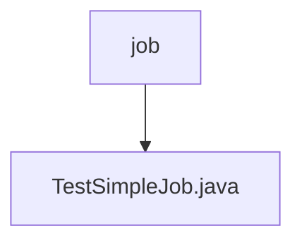

# 基础信息

|      |      |
|------|------|
| 名称 | job |
| 编码语言 | .java |
| 代码路径 | rabbit-parent/rabbit-task-example/src/main/java/com/itihub/rabbit/task/example/job |
| 包名 | rabbit-parent.docs.rabbit-task-example.src.main.java.com.itihub.rabbit.task.example.job |
| 概述说明 | 定时任务TestSimpleJob，每5秒执行，分2片，监听端口8889，支持故障转移。 |

# 说明

这是一个名为TestSimpleJob的简单作业类，配置了ElasticJob框架。作业核心配置包括：作业名称为testSimpleJob，每5秒执行一次的cron表达式，分片总数为2，分片参数0对应北京、1对应上海，作业参数包含source1和source2，启用了故障转移功能，作业描述为test job。Lite作业配置设置了8889监控端口，监听器配置指定了SimpleJobListener类。作业执行时会输出日志信息"============== TestSimpleJob"。

### 包内部结构视图

该流程图展示了rabbit-task-example项目中job目录与TestSimpleJob.java文件的层级关系。job作为父目录节点，包含一个子节点TestSimpleJob.java，表示这是一个简单的Java任务类文件存放在job目录下的结构关系。整个结构仅包含两层，清晰体现了单一任务文件的存储位置。

# 文件列表 File List

| 名称   | 类型  | 说明 |
|-------|------|-------------|
| [TestSimpleJob.java](TestSimpleJob.md) | file | 定时任务TestSimpleJob，每5秒执行，分2片，监听端口8889，支持故障转移。 |

