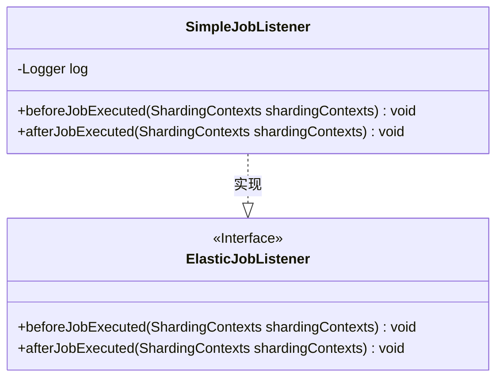
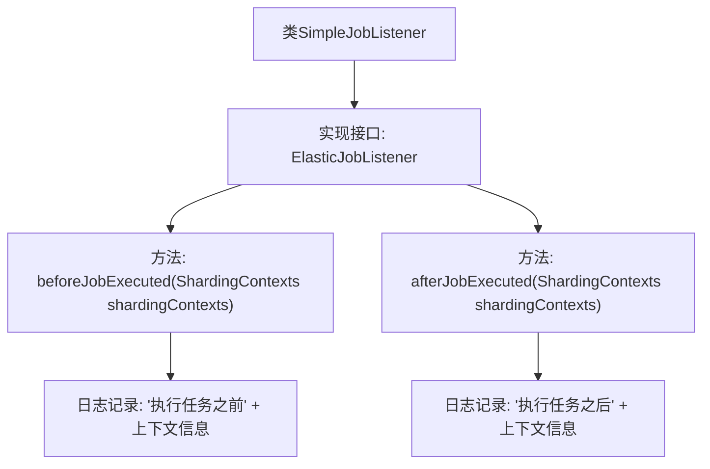

# 基础信息

|      |      |
|------|------|
| 名称 | SimpleJobListener |
| 编码语言 | .java |
| 代码路径 | rabbit-parent/rabbit-task-example/src/main/java/com/itihub/rabbit/task/example/listener/SimpleJobListener.java |
| 包名 | com.itihub.rabbit.task.example.listener |
| 依赖项 | ['com.alibaba.fastjson.JSON', 'com.dangdang.ddframe.job.executor.ShardingContexts', 'com.dangdang.ddframe.job.lite.api.listener.ElasticJobListener', 'lombok.extern.slf4j.Slf4j'] |
| 概述说明 | SimpleJobListener类实现ElasticJobListener接口，记录任务执行前后分片上下文日志。 |

# 说明

这是一个名为SimpleJobListener的Java类，实现了ElasticJobListener接口。该类包含两个方法：beforeJobExecuted在任务执行前触发，afterJobExecuted在任务执行后触发。两个方法都接收ShardingContexts参数，并通过日志记录上下文信息，使用JSON格式输出。类使用了Lombok的@Slf4j注解自动生成日志对象。

# 类列表 Class Summary

| 名称   | 类型  | 说明 |
|-------|------|-------------|
| SimpleJobListener | class | SimpleJobListener实现ElasticJobListener接口，记录任务执行前后分片上下文日志。 |

## 类 SimpleJobListener

|      |      |
|------|------|
| 访问范围 | @Slf4j;public |
| 类型 | class |
| 名称 | SimpleJobListener |
| 说明 | SimpleJobListener实现ElasticJobListener接口，记录任务执行前后分片上下文日志。 |

### UML类图

这段类图展示了SimpleJobListener类实现了ElasticJobListener接口的结构关系。ElasticJobListener作为接口定义了两个核心方法：beforeJobExecuted和afterJobExecuted，分别在作业执行前后触发。SimpleJobListener作为具体实现类，通过@Slf4j注解持有日志记录能力，并重写了接口方法，在方法中添加了日志记录功能来追踪分片上下文信息。该设计遵循了依赖倒置原则，使得作业监听逻辑可以灵活扩展。

### 内部方法调用关系图

该流程图展示了SimpleJobListener类的结构，该类实现了ElasticJobListener接口，包含两个核心方法：beforeJobExecuted和afterJobExecuted。这两个方法分别在任务执行前后被调用，并通过日志记录任务执行状态和上下文信息。流程清晰展现了从类定义到方法实现，再到具体日志记录操作的完整调用链，体现了对ElasticJob任务执行过程的状态监控能力。

### 字段列表 Field List

| 名称  | 类型  | 说明 |
|-------|-------|------|

### 方法列表 Method List

| 名称  | 类型  | 说明 |
|-------|-------|------|
| beforeJobExecuted | void | 重写方法，任务执行前打印分片上下文日志。 |
| afterJobExecuted | void | 重写方法，任务执行后记录分片上下文日志。 |

