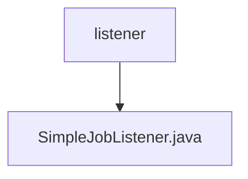

# 基础信息

|      |      |
|------|------|
| 名称 | listener |
| 编码语言 | .java |
| 代码路径 | rabbit-parent/rabbit-task-example/src/main/java/com/itihub/rabbit/task/example/listener |
| 包名 | rabbit-parent.docs.rabbit-task-example.src.main.java.com.itihub.rabbit.task.example.listener |
| 概述说明 | SimpleJobListener类实现ElasticJobListener接口，记录任务执行前后分片上下文日志。 |

# 说明

这是一个名为SimpleJobListener的Java类，实现了ElasticJobListener接口。该类包含两个方法：beforeJobExecuted在任务执行前触发，afterJobExecuted在任务执行后触发。两个方法都接收ShardingContexts参数，并通过日志记录上下文信息，使用JSON格式输出。类使用了Lombok的@Slf4j注解自动生成日志对象。

### 包内部结构视图

该流程图展示了rabbit-task-example项目中listener目录与SimpleJobListener.java文件之间的层级关系。listener作为父节点，包含一个子节点SimpleJobListener.java，表示这是一个监听器实现类位于监听器包内的典型Java项目结构。这种单层结构常见于任务调度系统中的监听器组件实现。

# 文件列表 File List

| 名称   | 类型  | 说明 |
|-------|------|-------------|
| [SimpleJobListener.java](SimpleJobListener.md) | file | SimpleJobListener类实现ElasticJobListener接口，记录任务执行前后分片上下文日志。 |

