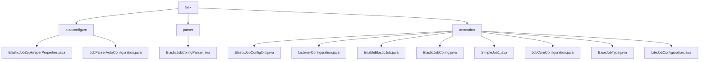

# 基础信息

|      |      |
|------|------|
| 名称 | task |
| 编码语言 | .java |
| 代码路径 | rabbit-parent/rabbit-task/src/main/java/com/itihub/rabbit/task |
| 包名 | rabbit-parent.docs.rabbit-task.src.main.java.com.itihub.rabbit.task |
| 概述说明 | Spring模块自动配置Elastic-Job与Zookeeper连接，管理注册中心和注解解析。 |

# 说明

## 概述

该代码模块是一个基于Spring和Elastic-Job的分布式任务调度框架，主要用于简化Elastic-Job与Zookeeper的集成和配置管理。模块通过自动配置和注解驱动的方式，提供了完整的任务调度解决方案，包括Zookeeper连接管理、作业配置解析和任务初始化等功能。核心特性如下：

1. **Zookeeper连接管理**：通过`ElasticJobZookeeperProperties`类集中管理Zookeeper连接参数，支持服务器地址、命名空间、超时设置和重试策略等配置。
2. **自动配置**：通过`JobParserAutoConfiguration`类实现Spring环境的自动初始化，包括Zookeeper注册中心和作业配置解析器的创建。
3. **注解驱动**：提供`@ElasticJobConfig`等注解来定义任务配置，支持任务类型标记、监听器配置和高级控制参数。
4. **任务解析与初始化**：通过`ElasticJobConfigParser`类解析注解配置，创建对应的作业配置并初始化`SpringJobScheduler`。

## 主要业务场景

1. **分布式任务调度**：
   - 通过`@ElasticJobConfig`和`JobCoreConfiguration`等注解配置分布式任务的基本属性，如任务名称、cron表达式和分片参数。
   - 适用于需要高可靠性和可扩展性的分布式任务执行场景。

2. **Zookeeper连接与注册中心管理**：
   - 提供灵活的Zookeeper连接参数配置，包括服务器地址、命名空间和超时设置。
   - 自动创建`ZookeeperRegistryCenter` bean，用于与Zookeeper集群建立连接和管理作业注册信息。
   - 适用于需要集中管理分布式任务协调和注册的场景。

3. **任务监听与事件追踪**：
   - 通过`ListenerConfiguration`配置任务监听器，支持任务执行前后的回调处理。
   - 适用于需要监控任务执行状态或执行额外逻辑的场景。

4. **任务启停与自动配置**：
   - 通过`EnableElasticJob`注解快速启用ElasticJob功能，实现任务的自动注册和配置。
   - 适用于需要快速集成任务调度功能的Spring应用。

5. **高级任务控制**：
   - 通过`LiteJobConfiguration`配置轻量级作业的高级参数，如监控执行、分片策略和事件追踪数据源。
   - 适用于需要精细控制任务行为的复杂调度场景。

该模块通过注解和自动配置的结合，显著简化了Elastic-Job的集成和配置过程，适用于各类需要分布式任务调用的应用场景。

### 包内部结构视图

该流程图展示了rabbit-task项目的核心目录结构，包含autoconfigure、parser和annotaion三个主要子目录。autoconfigure目录下有两个自动配置类文件，parser目录包含一个作业配置解析器，annotaion目录则集中了9个与作业配置相关的注解类文件，形成了清晰的层级关系。所有节点均使用路径末端名称，完整呈现了项目框架的关键组成部分。

# 文件列表 File List

| 名称   | 类型  | 说明 |
|-------|------|-------------|
| [annotaion](annotaion/_module.md) | package | ElasticJob相关Java注解配置，包含任务参数、监听器、核心配置等。 |
| [parser](parser/_module.md) | package | 解析ElasticJob配置，初始化SpringJobScheduler并注册到Spring容器。 |
| [autoconfigure](autoconfigure/_module.md) | package | ElasticJob的Zookeeper连接配置类，含地址、命名空间、超时和重试参数，支持自动配置注册中心和注解解析器。 |

