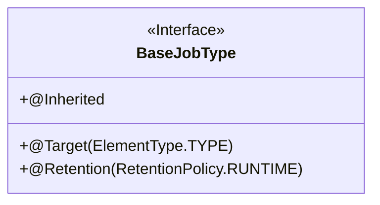
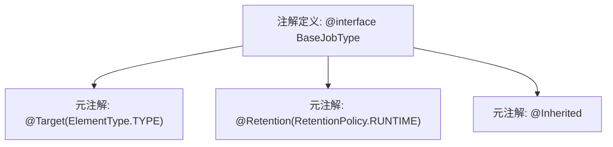

# 基础信息

|      |      |
|------|------|
| 名称 | BaseJobType |
| 编码语言 | .java |
| 代码路径 | rabbit-parent/rabbit-task/src/main/java/com/itihub/rabbit/task/annotaion/BaseJobType.java |
| 包名 | com.itihub.rabbit.task.annotaion |
| 依赖项 | ['java.lang.annotation'] |
| 概述说明 | Java注解BaseJobType，用于类，运行时保留，可继承。 |

# 说明

该内容定义了一个名为BaseJobType的Java注解。注解使用@Target(ElementType.TYPE)指定其适用于类、接口或枚举类型。@Retention(RetentionPolicy.RUNTIME)表示该注解在运行时保留，可通过反射读取。@Inherited表明该注解具有继承性，子类会继承父类的该注解。该注解为空注解，未定义任何成员变量或方法。

# 类列表 Class Summary

| 名称   | 类型  | 说明 |
|-------|------|-------------|
| BaseJobType | annotation | Java注解BaseJobType，用于类，运行时保留，可继承。 |

## 类 BaseJobType

|      |      |
|------|------|
| 访问范围 | @Target(ElementType.TYPE);@Retention(RetentionPolicy.RUNTIME);@Inherited;public |
| 类型 | annotation |
| 名称 | BaseJobType |
| 说明 | Java注解BaseJobType，用于类，运行时保留，可继承。 |

### UML类图

这段代码定义了一个名为`BaseJobType`的Java注解接口，该接口被标记为元注解（通过`@Target`指定作用于类型），具有运行时保留策略（通过`@Retention`指定）且允许继承（通过`@Inherited`）。类图展示了其作为接口的特殊性（用`<<Interface>>`标注）和三个公有元注解属性，这些属性决定了注解的使用范围和生命周期特性。该注解本身不包含成员变量或方法，仅作为标记型注解使用。

### 内部方法调用关系图

该流程图展示了Java注解`BaseJobType`的定义结构，包含三个关键元注解：`@Target`指定注解适用于类/接口类型，`@Retention`声明注解在运行时保留，`@Inherited`允许子类继承父类注解。整个结构呈现为注解定义节点连接三个元注解配置节点，清晰体现了注解的元数据特性。这种设计常用于框架级注解，为后续的反射处理提供基础支持。

### 字段列表 Field List

| 名称  | 类型  | 说明 |
|-------|-------|------|

### 方法列表 Method List

| 名称  | 类型  | 说明 |
|-------|-------|------|

