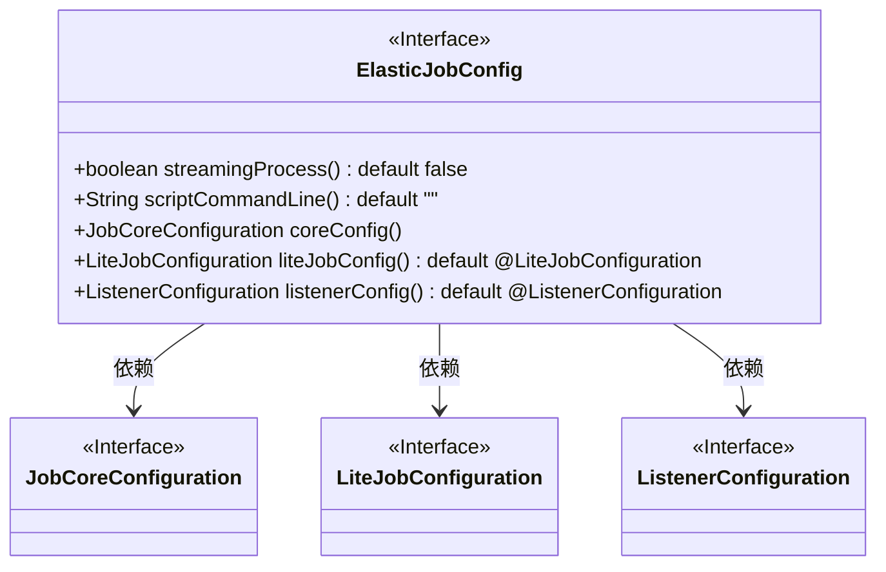
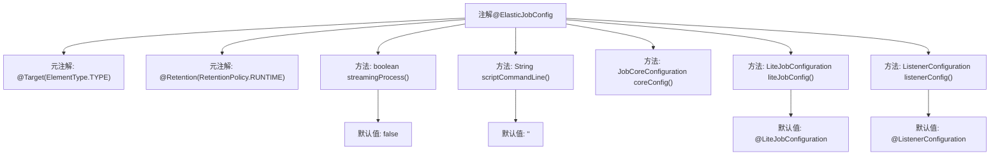

# 基础信息

|      |      |
|------|------|
| 名称 | ElasticJobConfig |
| 编码语言 | .java |
| 代码路径 | rabbit-parent/rabbit-task/src/main/java/com/itihub/rabbit/task/annotaion/ElasticJobConfig.java |
| 包名 | com.itihub.rabbit.task.annotaion |
| 依赖项 | ['org.springframework.core.annotation.AliasFor', 'java.lang.annotation.ElementType', 'java.lang.annotation.Retention', 'java.lang.annotation.RetentionPolicy', 'java.lang.annotation.Target'] |
| 概述说明 | ElasticJobConfig注解定义作业配置，包括流式处理、脚本命令、核心和轻量级作业配置及监听器设置。 |

# 说明

ElasticJobConfig是一个Java注解，用于配置ElasticJob作业。它包含多个配置项：streamingProcess控制数据流式处理行为，默认为false；scriptCommandLine用于指定脚本作业的命令行，默认为空字符串；coreConfig是必需的JobCoreConfiguration配置；liteJobConfig是LiteJobConfiguration配置，默认为空注解；listenerConfig是ListenerConfiguration配置，默认为空注解。该注解作用于类型级别，并在运行时保留。

# 类列表 Class Summary

| 名称   | 类型  | 说明 |
|-------|------|-------------|
| ElasticJobConfig | annotation | ElasticJobConfig注解定义作业配置，包括流式处理、脚本命令、核心和轻量级作业配置及监听设置。 |

## 类 ElasticJobConfig

|      |      |
|------|------|
| 访问范围 | @Target(ElementType.TYPE);@Retention(RetentionPolicy.RUNTIME);public |
| 类型 | annotation |
| 名称 | ElasticJobConfig |
| 说明 | ElasticJobConfig注解定义作业配置，包括流式处理、脚本命令、核心和轻量级作业配置及监听设置。 |

### UML类图

这段类图描述了一个名为ElasticJobConfig的Java注解接口，它定义了分布式作业框架中的核心配置项。该接口包含流式处理标志、脚本命令、核心作业配置、轻量级作业配置和监听器配置五个主要方法，其中后三个方法分别依赖于JobCoreConfiguration、LiteJobConfiguration和ListenerConfiguration三个接口。这些配置项共同构成了弹性作业的基础框架配置，用于控制作业的执行方式、脚本处理和监听行为。

### 内部方法调用关系图

这段代码定义了一个名为`@ElasticJobConfig`的Java注解，用于配置ElasticJob框架中的作业参数。该注解包含流式处理开关、脚本命令、核心配置等关键作业属性，通过元注解限定其作用于类级别并保留至运行时。各配置项均提供默认值，其中`coreConfig()`是必填项，其余如监听器配置等可选，整体结构清晰体现了作业配置的灵活性和可扩展性。

### 字段列表 Field List

| 名称  | 类型  | 说明 |
|-------|-------|------|
| scriptCommandLine | String | 空字符串默认返回空命令行 |
| coreConfig | JobCoreConfiguration | 获取任务核心配置信息 |
| liteJobConfig | LiteJobConfiguration | LiteJob配置默认注解 |
| listenerConfig | ListenerConfiguration | 监听配置默认使用@ListenerConfiguration。 |
| streamingProcess | boolean | 布尔型流处理默认关闭 |

### 方法列表 Method List

| 名称  | 类型  | 说明 |
|-------|-------|------|

