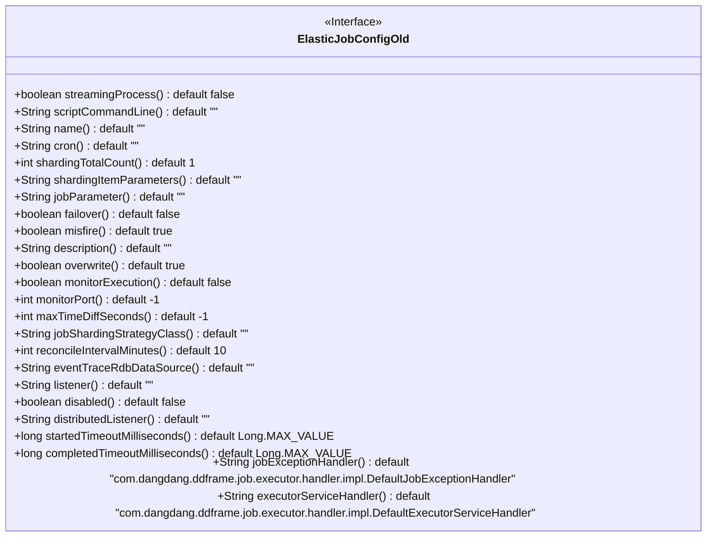

# 基础信息

|      |      |
|------|------|
| 名称 | ElasticJobConfigOld |
| 编码语言 | .java |
| 代码路径 | rabbit-parent/rabbit-task/src/main/java/com/itihub/rabbit/task/annotaion/ElasticJobConfigOld.java |
| 包名 | com.itihub.rabbit.task.annotaion |
| 依赖项 | ['java.lang.annotation.ElementType', 'java.lang.annotation.Retention', 'java.lang.annotation.RetentionPolicy', 'java.lang.annotation.Target'] |
| 概述说明 | 废弃的ElasticJob旧配置注解，包含作业名称、分片、超时等参数。 |

# 说明

该内容定义了一个名为ElasticJobConfigOld的Java注解接口，标记为已弃用。注解包含多个配置参数，主要用于设置定时任务的属性。关键参数包括任务名称、cron表达式、分片总数、分片参数、任务参数、失败转移、错过任务是否触发、任务描述、是否覆盖等。还包含监控执行、监听端口、最大时间差、分片策略类、协调间隔、事件追踪数据源、监听器、是否禁用、分布式监听器、启动和完成超时时间、任务异常处理器和执行服务处理器等高级配置选项。大多数参数设有默认值，部分参数标记为必须配置。

# 类列表 Class Summary

| 名称   | 类型  | 说明 |
|-------|------|-------------|
| ElasticJobConfigOld | annotation | 废弃的ElasticJob旧配置注解，包含任务名称、分片、超时等参数。 |

## 类 ElasticJobConfigOld

|      |      |
|------|------|
| 访问范围 | @Deprecated;@Target(ElementType.TYPE);@Retention(RetentionPolicy.RUNTIME);public |
| 类型 | annotation |
| 名称 | ElasticJobConfigOld |
| 说明 | 废弃的ElasticJob旧配置注解，包含任务名称、分片、超时等参数。 |

### UML类图

这段代码定义了一个名为`ElasticJobConfigOld`的Java注解接口，用于配置ElasticJob框架的任务参数。该接口包含23个配置项，涵盖任务名称、调度时间、分片策略、容错机制、监控参数等核心功能，其中多项配置带有默认值。注解标记为`@Deprecated`表明已不推荐使用，但仍保留运行时可见性(`RUNTIME`保留策略)。所有配置方法均为抽象方法，返回类型包括基本类型、字符串和布尔值，主要用于定义分布式任务的详细执行策略。

### 内部方法调用关系图

该流程图展示了ElasticJobConfigOld注解的所有属性及其默认值。这是一个用于配置ElasticJob作业的注解，包含作业名称、cron表达式、分片参数、容错配置、监控设置等23个可配置项，其中多个属性标记了'must'表示重要参数。注解通过默认值简化配置，支持作业流式处理、分片策略定制、超时控制等高级功能，适用于分布式定时任务场景。

### 字段列表 Field List

| 名称  | 类型  | 说明 |
|-------|-------|------|
| monitorPort | int | 监控端口默认值为-1 |
| listener | String | 字符串监听器默认空值 |
| shardingItemParameters | String | 方法定义：分片参数默认空字符串。 |
| misfire | boolean | 布尔型方法misfire()默认返回true。 |
| name | String | 声明返回空字符串的方法name()。 |
| reconcileIntervalMinutes | int | 方法返回默认10分钟的间隔时间。 |
| failover | boolean | 布尔型故障转移，默认关闭。 |
| jobParameter | String | 定义字符串类型参数jobParameter，默认值为空字符串。 |
| jobShardingStrategyClass | String | 默认返回空字符串的作业分片策略类方法。 |
| cron | String | 定义字符串类型cron方法，默认返回空字符串。 |
| maxTimeDiffSeconds | int | 方法maxTimeDiffSeconds默认返回-1。 |
| description | String | 空描述 |
| distributedListener | String | 分布式监听器默认空字符串 |
| monitorExecution | boolean | 监控执行状态，默认关闭。 |
| disabled | boolean | 禁用状态默认关闭 |
| streamingProcess | boolean | 布尔流处理默认关闭 |
| overwrite | boolean | 布尔型覆盖方法，默认值为真。 |
| scriptCommandLine | String | 定义脚本命令行字符串，默认为空。 |
| shardingTotalCount | int | 分片总数默认为1 |
| eventTraceRdbDataSource | String | 事件追踪数据源默认空字符串 |
| startedTimeoutMilliseconds | long | 长整型启动超时毫秒数，默认最大值。 |
| completedTimeoutMilliseconds | long | 方法返回长整型超时毫秒数，默认最大值。 |
| jobExceptionHandler | String | 默认作业异常处理器为DefaultJobExceptionHandler。 |
| executorServiceHandler | String | 默认执行处理器为DefaultExecutorServiceHandler。 |

### 方法列表 Method List

| 名称  | 类型  | 说明 |
|-------|-------|------|

