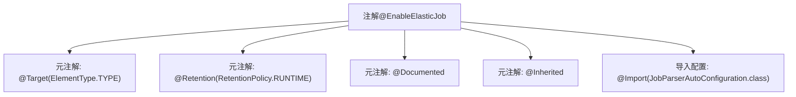

# 基础信息

|      |      |
|------|------|
| 名称 | EnableElasticJob |
| 编码语言 | .java |
| 代码路径 | rabbit-parent/rabbit-task/src/main/java/com/itihub/rabbit/task/annotaion/EnableElasticJob.java |
| 包名 | com.itihub.rabbit.task.annotaion |
| 依赖项 | ['com.itihub.rabbit.task.autoconfigure.JobParserAutoConfiguration', 'org.springframework.context.annotation.Import', 'java.lang.annotation'] |
| 概述说明 | 启用ElasticJob的注解，包含运行时保留、自动配置导入等特性。 |

# 说明

这是一个名为EnableElasticJob的Java注解，用于启用ElasticJob功能。该注解具有运行时保留策略，会被文档记录，并且可以被子类继承。它通过导入JobParserAutoConfiguration类来实现自动配置。注解目标为类型级别，可以应用于类或接口上。

# 类列表 Class Summary

| 名称   | 类型  | 说明 |
|-------|------|-------------|
| EnableElasticJob | annotation | 启用ElasticJob的注解，包含自动配置导入和继承特性。 |


## 类 EnableElasticJob

|      |      |
|------|------|
| 访问范围 | @Target(ElementType.TYPE);@Retention(RetentionPolicy.RUNTIME);@Documented;@Inherited;@Import(JobParserAutoConfiguration.class);public |
| 类型 | annotation |
| 名称 | EnableElasticJob |
| 说明 | 启用ElasticJob的注解，包含自动配置导入和继承特性。 |


### UML类图

```mermaid
classDiagram
    class EnableElasticJob {
        <<Interface>>
        +@Target(ElementType.TYPE)
        +@Retention(RetentionPolicy.RUNTIME)
        +@Documented
        +@Inherited
        +@Import(JobParserAutoConfiguration.class)
    }
    EnableElasticJob ..> JobParserAutoConfiguration : 依赖: 通过@Import引入配置类
```

该类图展示了一个Spring框架的注解接口`EnableElasticJob`，它通过元注解（如`@Target`、`@Retention`等）定义了注解的适用范围和生命周期，并通过`@Import`导入了`JobParserAutoConfiguration`配置类。此注解具有`@Inherited`特性，允许子类继承父类的注解，主要用于标记需要启用ElasticJob功能的Spring应用。图中清晰呈现了注解的元数据结构和与配置类的依赖关系。


### 内部方法调用关系图



该流程图描述了Spring风格的注解@EnableElasticJob的组成结构。该注解通过五个元注解定义其行为：限定作用于类（@Target）、保留至运行时（@Retention）、生成文档（@Documented）、允许继承（@Inherited），并自动导入JobParserAutoConfiguration配置类（@Import）。这种设计模式常用于Spring Boot的自动配置场景，通过声明式注解触发特定功能的初始化流程。

### 字段列表 Field List

| 名称  | 类型  | 说明 |
|-------|-------|------|

### 方法列表 Method List

| 名称  | 类型  | 说明 |
|-------|-------|------|


