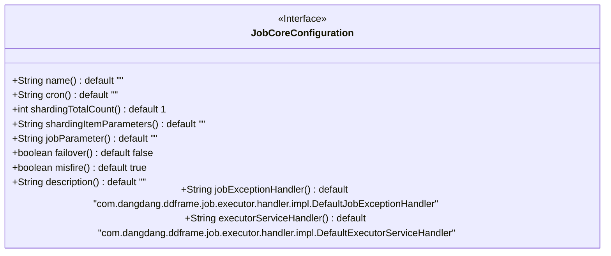

# 基础信息

|      |      |
|------|------|
| 名称 | JobCoreConfiguration |
| 编码语言 | .java |
| 代码路径 | rabbit-parent/rabbit-task/src/main/java/com/itihub/rabbit/task/annotaion/JobCoreConfiguration.java |
| 包名 | com.itihub.rabbit.task.annotaion |
| 依赖项 | ['java.lang.annotation.Retention', 'java.lang.annotation.RetentionPolicy', 'java.lang.annotation.Target'] |
| 概述说明 | 定义作业配置的注解，包括名称、cron表达式、分片参数、自定义参数、失效转移等设置。 |

# 说明

JobCoreConfiguration是一个Java注解，用于配置作业核心参数。它包含作业名称、cron表达式控制触发时间、分片总数默认1、分片序列号和参数键值对、作业自定义参数用于业务传参。支持任务执行失效转移和错过任务重执行，提供作业描述信息。默认异常处理和服务处理器分别为DefaultJobExceptionHandler和DefaultExecutorServiceHandler。

# 类列表 Class Summary

| 名称   | 类型  | 说明 |
|-------|------|-------------|
| JobCoreConfiguration | annotation | 定义作业配置注解，包括名称、cron、分片数、参数、失效转移等设置。 |

## 类 JobCoreConfiguration

|      |      |
|------|------|
| 访问范围 | @Target({});@Retention(RetentionPolicy.RUNTIME);public |
| 类型 | annotation |
| 名称 | JobCoreConfiguration |
| 说明 | 定义作业配置注解，包括名称、cron、分片数、参数、失效转移等设置。 |

### UML类图

这段代码定义了一个名为`JobCoreConfiguration`的Java注解接口，用于配置作业调度的核心参数。该接口包含多个默认方法，分别用于设置作业名称、cron表达式、分片总数、分片参数、自定义参数、失效转移开关、错过任务重执行开关、描述信息以及异常处理类等。这些配置项为分布式作业调度提供了细粒度的控制能力，支持分片处理、容错机制和自定义异常处理等关键功能。注解通过运行时保留策略（RUNTIME）确保配置信息在程序运行期间可被读取。

### 内部方法调用关系图

```mermaid
graph TD
    A["注解: @JobCoreConfiguration"]
    B["元注解: @Target({})"]
    C["元注解: @Retention(RUNTIME)"]
    D["属性: String name() default ''"]
    E["属性: String cron() default ''"]
    F["属性: int shardingTotalCount() default 1"]
    G["属性: String shardingItemParameters() default ''"]
    H["属性: String jobParameter() default ''"]
    I["属性: boolean failover() default false"]
    J["属性: boolean misfire() default true"]
    K["属性: String description() default ''"]
    L["属性: String jobExceptionHandler() default 'DefaultJobExceptionHandler'"]
    M["属性: String executorServiceHandler() default 'DefaultExecutorServiceHandler'"]

    A --> B
    A --> C
    A --> D
    A --> E
    A --> F
    A --> G
    A --> H
    A --> I
    A --> J
    A --> K
    A --> L
    A --> M
```

这段代码定义了一个名为`@JobCoreConfiguration`的Java注解，用于配置分布式作业的核心参数。该注解包含12个可配置属性，包括作业名称、cron表达式、分片总数、分片参数、异常处理器等，并指定了运行时保留策略。每个属性都有默认值，支持作业分片、容错机制、自定义参数等分布式任务调度场景的关键功能，是Elastic-Job框架的核心配置注解。

### 字段列表 Field List

| 名称  | 类型  | 说明 |
|-------|-------|------|
| description | String | 描述信息为空。 |
| misfire | boolean | 布尔型方法misfire，默认返回true。 |
| failover | boolean | 布尔型故障转移方法，默认返回false。 |
| shardingTotalCount | int | 分片总数默认为1。 |
| jobExceptionHandler | String | 默认作业异常处理器为DefaultJobExceptionHandler。 |
| jobParameter | String | 定义字符串参数jobParameter，默认值为空字符串。 |
| executorServiceHandler | String | 默认执行处理器为DefaultExecutorServiceHandler。 |
| shardingItemParameters | String | 字符串分片参数默认空 |
| cron | String | 声明一个返回字符串的cron方法，默认返回空字符串。 |
| name | String | 定义返回字符串的方法，默认返回空字符串。 |

### 方法列表 Method List

| 名称  | 类型  | 说明 |
|-------|-------|------|

