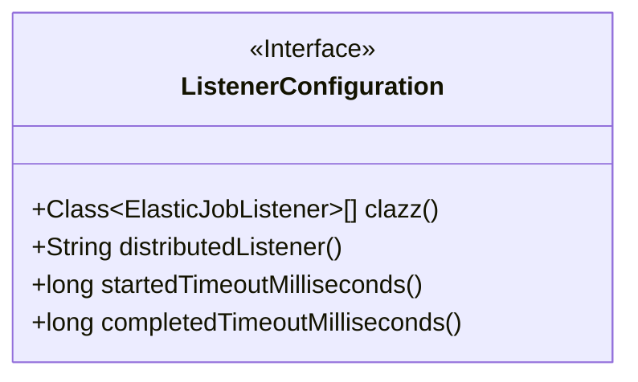
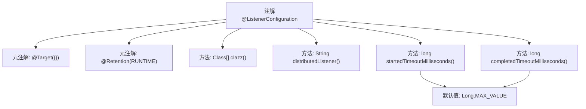

# 基础信息

|      |      |
|------|------|
| 名称 | ListenerConfiguration |
| 编码语言 | .java |
| 代码路径 | rabbit-parent/rabbit-task/src/main/java/com/itihub/rabbit/task/annotaion/ListenerConfiguration.java |
| 包名 | com.itihub.rabbit.task.annotaion |
| 依赖项 | ['com.dangdang.ddframe.job.lite.api.listener.AbstractDistributeOnceElasticJobListener', 'com.dangdang.ddframe.job.lite.api.listener.ElasticJobListener', 'java.lang.annotation.Retention', 'java.lang.annotation.RetentionPolicy', 'java.lang.annotation.Target'] |
| 概述说明 | 定义监听器配置注解，包含实现类、超时时间等参数。 |

# 说明

ListenerConfiguration是一个Java注解，用于配置分布式任务监听器。它要求监听器实现类继承AbstractDistributeOnceElasticJobListener。主要配置项包括：clazz指定监听器类数组，distributedListener为分布式监听器名称。startedTimeoutMilliseconds设置最后一个作业执行前方法的超时时间（毫秒），默认Long.MAX_VALUE。completedTimeoutMilliseconds设置最后一个作业执行后方法的超时时间（毫秒），默认同样为Long.MAX_VALUE。这两个超时时间都是必须配置的参数。

# 类列表 Class Summary

| 名称   | 类型  | 说明 |
|-------|------|-------------|
| ListenerConfiguration | annotation | ListenerConfiguration注解：定义分布式监听类及前后任务超时时间。 |

## 类 ListenerConfiguration

|      |      |
|------|------|
| 访问范围 | @Target({});@Retention(RetentionPolicy.RUNTIME);public |
| 类型 | annotation |
| 名称 | ListenerConfiguration |
| 说明 | ListenerConfiguration注解：定义分布式监听类及前后任务超时时间。 |

### UML类图

该代码定义了一个名为ListenerConfiguration的Java注解接口，主要用于配置分布式作业监听器的相关参数。注解包含四个方法：clazz()用于指定监听器实现类（需继承AbstractDistributeOnceElasticJobListener），distributedListener()用于设置分布式监听器名称，startedTimeoutMilliseconds()和completedTimeoutMilliseconds()分别设置作业开始前和完成后的超时时间（单位毫秒）。该注解运行时保留，适用于框架级别的作业监听配置。

### 内部方法调用关系图

该流程图展示了@ListenerConfiguration注解的结构，包含两个元注解声明和四个配置方法。核心功能是定义弹性作业监听器的配置参数，包括监听器实现类、分布式监听器名称，以及前后置任务执行的超时时间控制（默认使用Long.MAX_VALUE）。注解设计用于分布式作业调度场景，通过运行时保留策略支持反射读取配置。

### 字段列表 Field List

| 名称  | 类型  | 说明 |
|-------|-------|------|
| distributedListener | String | 分布式监听器默认空字符串 |
| clazz | Class<? extends ElasticJobListener>[] | 定义ElasticJobListener类的默认空数组。 |
| startedTimeoutMilliseconds | long | 长整型启动超时毫秒数，默认最大值。 |
| completedTimeoutMilliseconds | long | 方法返回长整型超时毫秒数，默认最大值。 |

### 方法列表 Method List

| 名称  | 类型  | 说明 |
|-------|-------|------|

