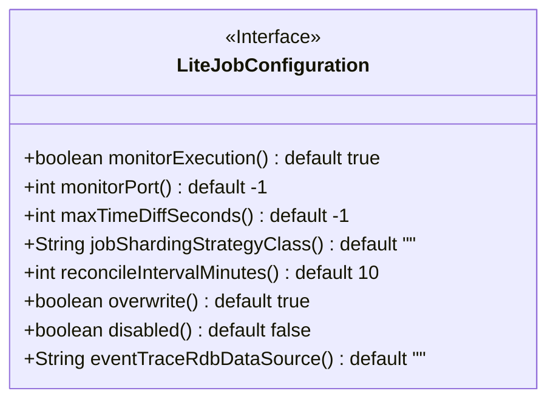
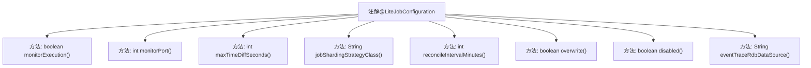

# 基础信息

|      |      |
|------|------|
| 名称 | LiteJobConfiguration |
| 编码语言 | .java |
| 代码路径 | rabbit-parent/rabbit-task/src/main/java/com/itihub/rabbit/task/annotaion/LiteJobConfiguration.java |
| 包名 | com.itihub.rabbit.task.annotaion |
| 依赖项 | ['java.lang.annotation.ElementType', 'java.lang.annotation.Retention', 'java.lang.annotation.RetentionPolicy', 'java.lang.annotation.Target'] |
| 概述说明 | LiteJob配置注解：监控执行、端口、时间误差、分片策略、修复间隔、覆盖配置、禁用状态、事件追踪。 |

# 说明

LiteJobConfiguration注解用于配置轻量级作业，包含多个关键参数：monitorExecution控制是否监控作业状态，短时作业建议关闭；monitorPort指定监控端口用于信息导出；maxTimeDiffSeconds设置最大时间误差秒数；jobShardingStrategyClass定义分片策略实现类；reconcileIntervalMinutes配置修复服务器状态的间隔时间；overwrite决定是否覆盖Zookeeper配置；disabled禁用作业；eventTraceRdbDataSource指定事件追踪数据源。默认值覆盖常见场景，参数均非强制必填。

# 类列表 Class Summary

| 名称   | 类型  | 说明 |
|-------|------|-------------|
| LiteJobConfiguration | annotation | LiteJob配置注解，含监控、端口、分片策略等参数。 |

## 类 LiteJobConfiguration

|      |      |
|------|------|
| 访问范围 | @Target({});@Retention(RetentionPolicy.RUNTIME);public |
| 类型 | annotation |
| 名称 | LiteJobConfiguration |
| 说明 | LiteJob配置注解，含监控、端口、分片策略等参数。 |

### UML类图

这段代码定义了一个名为`LiteJobConfiguration`的Java注解接口，主要用于配置轻量级作业的各种参数。该接口包含8个配置项：监控执行状态标志(默认true)、监控端口(默认-1)、最大时间差秒数(默认-1)、分片策略类名(默认空字符串)、修复间隔分钟数(默认10)、覆盖Zookeeper配置标志(默认true)、禁用标志(默认false)和事件追踪数据源引用(默认空字符串)。每个配置项都有详细的文档注释说明其用途和默认值，这些配置项共同构成了作业调度的基础框架配置。

### 内部方法调用关系图

该流程图展示了@LiteJobConfiguration注解的结构及其包含的8个配置方法。该注解主要用于定义轻量级作业的运行时配置，包括执行监控、端口设置、时间误差校验、分片策略等核心功能。每个配置方法都有明确的默认值，例如monitorExecution默认启用监控，monitorPort默认-1表示不强制要求配置。注解设计考虑了作业状态追踪、分布式协调、策略扩展等分布式调度场景的关键需求。

### 字段列表 Field List

| 名称  | 类型  | 说明 |
|-------|-------|------|
| reconcileIntervalMinutes | int | 方法返回默认10分钟的协调间隔。 |
| monitorExecution | boolean | 监控执行状态，默认开启 |
| jobShardingStrategyClass | String | 定义作业分片策略类，默认空字符串。 |
| maxTimeDiffSeconds | int | 最大时间差秒数，默认-1。 |
| monitorPort | int | 监控端口默认值为-1 |
| overwrite | boolean | 布尔类型方法overwrite，默认返回true。 |
| disabled | boolean | 布尔禁用默认false |
| eventTraceRdbDataSource | String | 事件追踪数据源默认空字符串。 |

### 方法列表 Method List

| 名称  | 类型  | 说明 |
|-------|-------|------|

