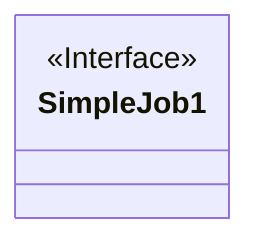
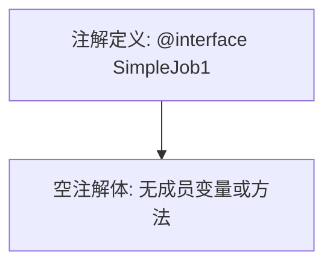

# 基础信息

|      |      |
|------|------|
| 名称 | SimpleJob1 |
| 编码语言 | .java |
| 代码路径 | rabbit-parent/rabbit-task/src/main/java/com/itihub/rabbit/task/annotaion/SimpleJob1.java |
| 包名 | com.itihub.rabbit.task.annotaion |
| 依赖项 | [] |
| 概述说明 | 简单任务接口定义 |

# 说明

这是一个名为SimpleJob1的公开接口定义，使用了@interface关键字声明。该接口目前为空，未包含任何成员或方法定义。作为公开接口，它可以被其他类或接口访问和实现。这种结构通常用于标记或配置类场景。

# 类列表 Class Summary

| 名称   | 类型  | 说明 |
|-------|------|-------------|
| SimpleJob1 | annotation | 简单任务接口定义 |

## 类 SimpleJob1

|      |      |
|------|------|
| 访问范围 | public |
| 类型 | annotation |
| 名称 | SimpleJob1 |
| 说明 | 简单任务接口定义 |

### UML类图

这段代码定义了一个名为SimpleJob1的注解接口（用@interface声明）。在类图中，我们使用<<Interface>>标记表示这是一个注解类型接口。注解在Java中是一种特殊的接口形式，用于为代码添加元数据。这个特定的注解SimpleJob1目前不包含任何成员变量或方法，是一个空注解，可能用作标记注解或为未来扩展预留。注解通常用于框架配置、编译时检查或运行时反射等场景。

### 内部方法调用关系图

这段流程图描述了一个名为SimpleJob1的Java注解定义。该注解是一个标记注解（marker annotation），因为它的定义体中没有任何成员变量或方法。图中展示了注解的声明节点和空实现体节点的关系，表明这是一个最简单的注解类型，仅用于标记而无需配置任何参数。这种注解通常用于提供元数据或标记特定程序元素。

### 字段列表 Field List

| 名称  | 类型  | 说明 |
|-------|-------|------|

### 方法列表 Method List

| 名称  | 类型  | 说明 |
|-------|-------|------|

