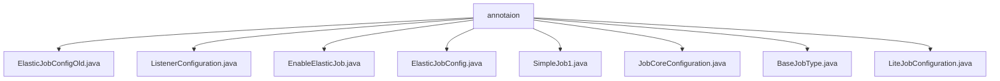

# 基础信息

|      |      |
|------|------|
| 名称 | annotaion |
| 编码语言 | .java |
| 代码路径 | rabbit-parent/rabbit-task/src/main/java/com/itihub/rabbit/task/annotaion |
| 包名 | rabbit-parent.docs.rabbit-task.src.main.java.com.itihub.rabbit.task.annotaion |
| 概述说明 | ElasticJob相关Java注解配置，包含任务参数、监听器、核心配置等。 |

# 说明

## 概述  
该代码模块是一个基于Java注解的ElasticJob任务调度配置框架，主要用于定义和管理分布式定时任务。模块提供了一系列注解来配置任务的各项参数，包括任务核心配置、轻量级作业配置、监听器配置等。支持任务分片、失败转移、事件追踪等高级特性，同时提供了任务启用和自动配置的机制。模块中的部分注解已被标记为弃用，推荐使用新版配置方式。

## 主要业务场景  
1. **分布式定时任务配置**：通过`ElasticJobConfig`和`JobCoreConfiguration`等注解配置定时任务的基本属性，如任务名称、cron表达式、分片参数等，适用于需要分布式执行的定时任务场景。  
2. **任务监听与事件追踪**：通过`ListenerConfiguration`配置分布式任务监听器，支持任务执行前后的回调处理，适用于需要监控任务执行状态或执行额外逻辑的场景。  
3. **任务启停与自动配置**：通过`EnableElasticJob`注解启用ElasticJob功能，实现任务的自动注册和配置，适用于需要快速集成任务调度功能的Spring应用。  
4. **高级任务控制**：通过`LiteJobConfiguration`配置轻量级作业的高级参数，如监控执行、分片策略、事件追踪数据源等，适用于需要精细控制任务行为的场景。  
5. **任务类型标记**：通过`BaseJobType`等空注解标记任务类型，适用于需要基于注解进行任务分类或处理的场景。  

模块中的注解设计覆盖了从基础任务配置到高级控制的完整流程，适用于需要高可靠性、可扩展性和分布式能力的任务调度系统。

### 包内部结构视图

该流程图展示了rabbit-task项目中annotation目录下的文件结构关系。根节点为annotation文件夹，其下直接包含8个Java注解类文件，包括ElasticJobConfigOld、ListenerConfiguration等，这些文件均位于同一层级，没有进一步的子目录嵌套。所有文件都属于任务调度相关的配置注解类，用于定义不同类型的定时任务配置。

# 文件列表 File List

| 名称   | 类型  | 说明 |
|-------|------|-------------|
| [BaseJobType.java](BaseJobType.md) | file | Java注解BaseJobType，用于类，运行时保留，可继承。 |
| [JobCoreConfiguration.java](JobCoreConfiguration.md) | file | 定义作业配置的注解，包括名称、cron表达式、分片参数、自定义参数、失效转移等设置。 |
| [SimpleJob1.java](SimpleJob1.md) | file | 简单任务接口定义 |
| [ElasticJobConfig.java](ElasticJobConfig.md) | file | ElasticJobConfig注解定义作业配置，包括流式处理、脚本命令、核心和轻量级作业配置及监听器设置。 |
| [EnableElasticJob.java](EnableElasticJob.md) | file | 启用ElasticJob的注解，包含运行时保留、自动配置导入等特性。 |
| [ListenerConfiguration.java](ListenerConfiguration.md) | file | 定义监听器配置注解，包含实现类、超时时间等参数。 |
| [ElasticJobConfigOld.java](ElasticJobConfigOld.md) | file | 废弃的ElasticJob旧配置注解，包含作业名称、分片、超时等参数。 |
| [LiteJobConfiguration.java](LiteJobConfiguration.md) | file | LiteJob配置注解：监控执行、端口、时间误差、分片策略、修复间隔、覆盖配置、禁用状态、事件追踪。 |

