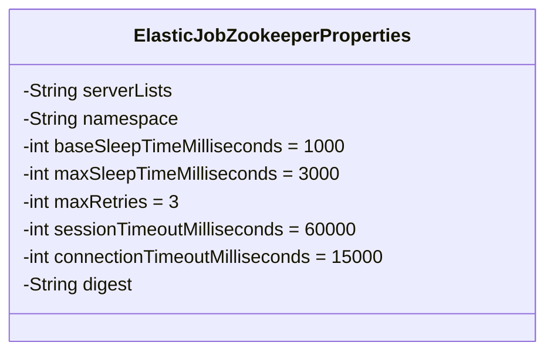
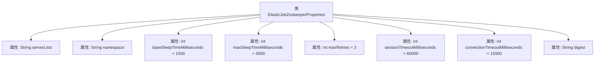

# 基础信息

|      |      |
|------|------|
| 名称 | ElasticJobZookeeperProperties |
| 编码语言 | .java |
| 代码路径 | rabbit-parent/rabbit-task/src/main/java/com/itihub/rabbit/task/autoconfigure/ElasticJobZookeeperProperties.java |
| 包名 | com.itihub.rabbit.task.autoconfigure |
| 依赖项 | ['lombok.Data', 'org.springframework.boot.context.properties.ConfigurationProperties'] |
| 概述说明 | ElasticJob的Zookeeper配置类，包含地址、命名空间、超时和重试参数等。 |

# 说明

该内容定义了一个名为ElasticJobZookeeperProperties的配置属性类，用于管理Elastic-Job与Zookeeper相关的连接配置。主要属性包括Zookeeper服务器地址列表、命名空间、重试间隔时间（初始值和最大值）、最大重试次数、会话超时时间、连接超时时间以及可选的权限令牌。这些属性均以毫秒为单位，并设置了默认值，便于灵活配置Zookeeper连接参数。

# 类列表 Class Summary

| 名称   | 类型  | 说明 |
|-------|------|-------------|
| ElasticJobZookeeperProperties | class | ElasticJob的Zookeeper配置类，包含地址、命名空间、超时和重试等参数。 |

## 类 ElasticJobZookeeperProperties

|      |      |
|------|------|
| 访问范围 | @Data;@ConfigurationProperties(prefix = "elastic-job.zookeeper");public |
| 类型 | class |
| 名称 | ElasticJobZookeeperProperties |
| 说明 | ElasticJob的Zookeeper配置类，包含地址、命名空间、超时和重试等参数。 |

### UML类图

该代码定义了一个名为`ElasticJobZookeeperProperties`的配置类，用于存储与Zookeeper相关的配置属性。类中包含多个私有字段，如`serverLists`（ZK地址列表）、`namespace`（命名空间）、`baseSleepTimeMilliseconds`（重试间隔初始值）等，这些字段通过`@ConfigurationProperties`注解与配置文件中的`elastic-job.zookeeper`前缀属性绑定。类主要用于集中管理分布式任务调度框架Elastic-Job与Zookeeper交互时的连接参数，如超时时间、重试策略等，默认值已预设常见配置。

### 内部方法调用关系图

这段代码定义了一个名为`ElasticJobZookeeperProperties`的配置类，用于管理Elastic-Job与Zookeeper相关的连接参数。类中包含8个属性，分别对应Zookeeper的服务器地址列表、命名空间、重试间隔时间配置（基础值和最大值）、最大重试次数、会话超时时间、连接超时时间以及权限令牌。所有属性都通过`@ConfigurationProperties`注解与配置文件中的`elastic-job.zookeeper`前缀绑定，便于集中管理分布式任务调度框架的ZK配置参数。

### 字段列表 Field List

| 名称  | 类型  | 说明 |
|-------|-------|------|
| maxSleepTimeMilliseconds = 3000 | int | 私有整型变量maxSleepTimeMilliseconds，默认值3000。 |
| namespace | String | 私有字符串变量命名空间。 |
| baseSleepTimeMilliseconds = 1000 | int | 私有整型变量，初始休眠时间1000毫秒。 |
| maxRetries = 3 | int | 私有整型变量maxRetries，默认值为3。 |
| serverLists | String | 私有字符串变量serverLists。 |
| sessionTimeoutMilliseconds = 60000 | int | 私有整型变量sessionTimeoutMilliseconds，默认值60000毫秒。 |
| connectionTimeoutMilliseconds = 15000 | int | 私有整型变量connectionTimeoutMilliseconds，默认值15000。 |
| digest | String | 私有字符串变量digest。 |

### 方法列表 Method List

| 名称  | 类型  | 说明 |
|-------|-------|------|

