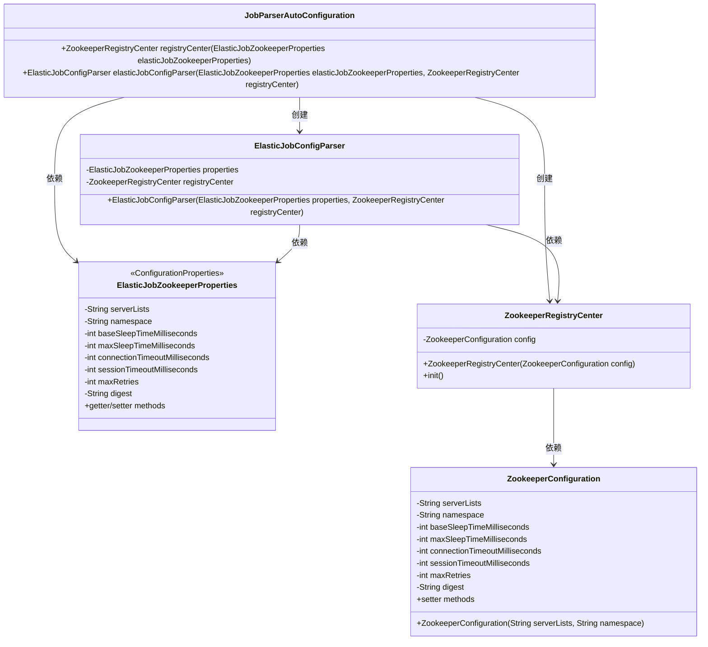
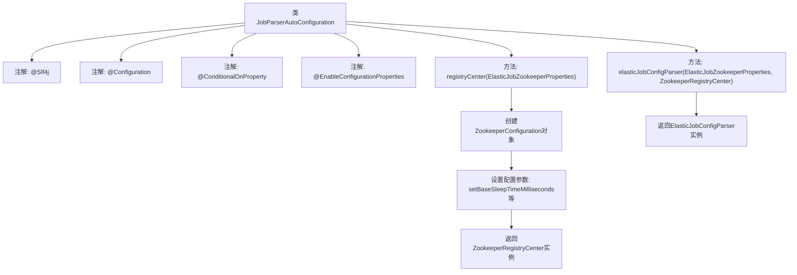

# 基础信息

|      |      |
|------|------|
| 名称 | JobParserAutoConfiguration |
| 编码语言 | .java |
| 代码路径 | rabbit-parent/rabbit-task/src/main/java/com/itihub/rabbit/task/autoconfigure/JobParserAutoConfiguration.java |
| 包名 | com.itihub.rabbit.task.autoconfigure |
| 依赖项 | ['com.dangdang.ddframe.job.reg.zookeeper.ZookeeperConfiguration', 'com.dangdang.ddframe.job.reg.zookeeper.ZookeeperRegistryCenter', 'com.itihub.rabbit.task.parser.ElasticJobConfigParser', 'lombok.extern.slf4j.Slf4j', 'org.springframework.boot.autoconfigure.condition.ConditionalOnProperty', 'org.springframework.boot.context.properties.EnableConfigurationProperties', 'org.springframework.context.annotation.Bean', 'org.springframework.context.annotation.Configuration'] |
| 概述说明 | 自动配置ElasticJob的Zookeeper注册中心和注解解析器。 |

# 说明

这是一个基于Spring的自动配置类，用于初始化ElasticJob的Zookeeper注册中心和自定义注解解析器。该类仅在配置文件中存在指定Zookeeper属性时生效。它创建了一个ZookeeperRegistryCenter bean，通过ElasticJobZookeeperProperties配置连接参数，包括服务器列表、命名空间、超时设置和重试策略等。同时注册了一个ElasticJobConfigParser bean，用于解析作业配置。所有bean都通过依赖注入方式获取所需参数。

# 类列表 Class Summary

| 名称   | 类型  | 说明 |
|-------|------|-------------|
| JobParserAutoConfiguration | class | 自动配置ElasticJob的Zookeeper注册中心和注解解析器。 |

## 类 JobParserAutoConfiguration

|      |      |
|------|------|
| 访问范围 | @Slf4j;@Configuration;@ConditionalOnProperty(prefix = "elastic-job.zookeeper", name = {"serverLists", "namespace"}, matchIfMissing = false);@EnableConfigurationProperties(ElasticJobZookeeperProperties.class);public |
| 类型 | class |
| 名称 | JobParserAutoConfiguration |
| 说明 | 自动配置ElasticJob的Zookeeper注册中心和注解解析器。 |

### UML类图

该图展示了JobParserAutoConfiguration配置类及其相关组件的结构关系。作为ElasticJob的Spring Boot自动配置类，它通过ElasticJobZookeeperProperties获取ZooKeeper配置，创建ZookeeperRegistryCenter注册中心实例，并初始化ElasticJobConfigParser解析器。ZookeeperConfiguration封装了ZooKeeper连接参数，ZookeeperRegistryCenter负责与ZooKeeper服务器的交互，而ElasticJobConfigParser则处理作业配置解析。整个结构体现了Spring Boot条件化配置与ElasticJob框架的集成方式。

### 内部方法调用关系图

这段代码是ElasticJob的自动配置类，主要完成两个核心功能：1) 初始化Zookeeper注册中心，通过读取配置参数构建ZookeeperConfiguration并创建ZookeeperRegistryCenter实例；2) 创建ElasticJobConfigParser解析器用于处理自定义注解。整个流程严格遵循Spring Boot自动配置规范，通过条件注解确保仅在满足Zookeeper服务地址和命名空间配置时才会生效。配置参数通过ElasticJobZookeeperProperties类集中管理，包含连接超时、会话超时、重试策略等Zookeeper客户端关键参数。

### 字段列表 Field List

| 名称  | 类型  | 说明 |
|-------|-------|------|

### 方法列表 Method List

| 名称  | 类型  | 说明 |
|-------|-------|------|
| elasticJobConfigParser | ElasticJobConfigParser | 创建ElasticJob配置解析器，依赖Zookeeper属性和注册中心。 |
| registryCenter | ZookeeperRegistryCenter | 创建Zookeeper注册中心，配置连接参数。 |

