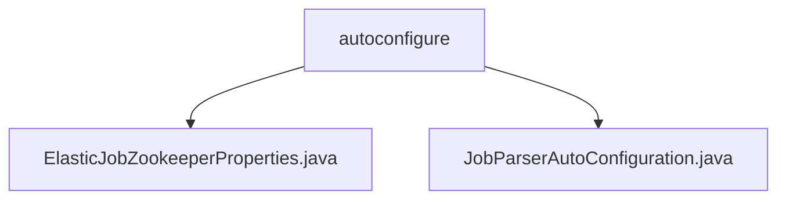

# 基础信息

|      |      |
|------|------|
| 名称 | autoconfigure |
| 编码语言 | .java |
| 代码路径 | rabbit-parent/rabbit-task/src/main/java/com/itihub/rabbit/task/autoconfigure |
| 包名 | rabbit-parent.docs.rabbit-task.src.main.java.com.itihub.rabbit.task.autoconfigure |
| 概述说明 | ElasticJob的Zookeeper连接配置类，含地址、命名空间、超时和重试参数，支持自动配置注册中心和注解解析器。 |

# 说明

## 概述

该代码模块是一个基于Spring的自动配置模块，主要用于管理和配置Elastic-Job与Zookeeper的连接参数，并初始化相关的注册中心和注解解析器。模块包含以下核心功能：

1. **配置管理**：通过`ElasticJobZookeeperProperties`类定义和管理Zookeeper的连接配置，包括服务器地址、命名空间、超时设置和重试策略等。
2. **自动配置**：通过`JobParserAutoConfiguration`类在Spring环境中自动初始化Zookeeper注册中心和作业配置解析器，仅在配置文件中存在相关属性时生效。

## 主要业务场景

1. **Zookeeper连接配置**：
   - 提供灵活的Zookeeper连接参数配置，包括服务器地址列表、命名空间、会话超时时间、连接超时时间等。
   - 支持重试策略配置，如重试间隔时间（初始值和最大值）和最大重试次数。
   - 可选配置权限令牌，用于安全验证。

2. **注册中心初始化**：
   - 根据配置参数自动创建`ZookeeperRegistryCenter` bean，用于与Zookeeper集群建立连接和管理作业注册信息。
   - 默认值设置简化了配置过程，同时支持自定义参数以满足不同环境需求。

3. **作业配置解析**：
   - 注册`ElasticJobConfigParser` bean，用于解析作业配置，支持通过注解或配置文件定义作业参数。
   - 通过依赖注入方式获取配置参数，确保与其他Spring组件的无缝集成。

该模块适用于需要分布式任务调用的场景，通过Zookeeper实现作业的协调和注册，简化了Elastic-Job的初始化和配置过程。

### 包内部结构视图

该流程图展示了rabbit-task项目中autoconfigure包的层级结构，包含两个自动配置类文件：ElasticJobZookeeperProperties和JobParserAutoConfiguration。这两个Java类文件都直接隶属于autoconfigure目录，用于处理与Zookeeper相关的任务配置和作业解析的自动配置逻辑，体现了Spring Boot自动配置的典型结构。

# 文件列表 File List

| 名称   | 类型  | 说明 |
|-------|------|-------------|
| [JobParserAutoConfiguration.java](JobParserAutoConfiguration.md) | file | 自动配置ElasticJob的Zookeeper注册中心和注解解析器。 |
| [ElasticJobZookeeperProperties.java](ElasticJobZookeeperProperties.md) | file | ElasticJob的Zookeeper配置类，包含地址、命名空间、超时和重试参数等。 |

