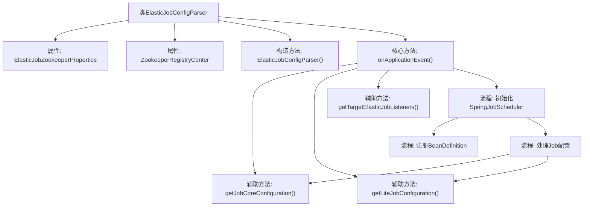

# 基础信息

|      |      |
|------|------|
| 名称 | ElasticJobConfigParser |
| 编码语言 | .java |
| 代码路径 | rabbit-parent/rabbit-task/src/main/java/com/itihub/rabbit/task/parser/ElasticJobConfigParser.java |
| 包名 | com.itihub.rabbit.task.parser |
| 依赖项 | ['com.dangdang.ddframe.job.api.ElasticJob', 'com.dangdang.ddframe.job.api.dataflow.DataflowJob', 'com.dangdang.ddframe.job.api.script.ScriptJob', 'com.dangdang.ddframe.job.api.simple.SimpleJob', 'com.dangdang.ddframe.job.config.JobCoreConfiguration', 'com.dangdang.ddframe.job.config.JobTypeConfiguration', 'com.dangdang.ddframe.job.config.dataflow.DataflowJobConfiguration', 'com.dangdang.ddframe.job.config.script.ScriptJobConfiguration', 'com.dangdang.ddframe.job.config.simple.SimpleJobConfiguration', 'com.dangdang.ddframe.job.event.rdb.JobEventRdbConfiguration', 'com.dangdang.ddframe.job.executor.handler.JobProperties', 'com.dangdang.ddframe.job.lite.api.listener.ElasticJobListener', 'com.dangdang.ddframe.job.lite.config.LiteJobConfiguration', 'com.dangdang.ddframe.job.lite.spring.api.SpringJobScheduler', 'com.dangdang.ddframe.job.reg.zookeeper.ZookeeperRegistryCenter', 'com.itihub.rabbit.task.annotaion.ElasticJobConfig', 'com.itihub.rabbit.task.annotaion.ListenerConfiguration', 'com.itihub.rabbit.task.autoconfigure.ElasticJobZookeeperProperties', 'org.springframework.beans.factory.config.BeanDefinition', 'org.springframework.beans.factory.support.BeanDefinitionBuilder', 'org.springframework.beans.factory.support.DefaultListableBeanFactory', 'org.springframework.beans.factory.support.ManagedList', 'org.springframework.boot.context.event.ApplicationReadyEvent', 'org.springframework.context.ApplicationListener', 'org.springframework.context.ConfigurableApplicationContext', 'org.springframework.util.Assert', 'org.springframework.util.StringUtils', 'java.util.Iterator', 'java.util.List', 'java.util.Map'] |
| 概述说明 | 解析ElasticJob配置，初始化SpringJobScheduler并注册到Spring容器。 |

# 说明

ElasticJobConfigParser类是一个Spring应用监听器，负责解析带有@ElasticJobConfig注解的作业配置。它通过ZookeeperRegistryCenter和ElasticJobZookeeperProperties初始化，监听ApplicationReadyEvent事件。主要功能包括：获取注解配置的作业实例，根据作业类型（SimpleJob、DataflowJob或ScriptJob）创建对应的JobTypeConfiguration，构建LiteJobConfiguration和JobCoreConfiguration。同时处理作业监听器配置，最终将SpringJobScheduler注册为Spring Bean并初始化。该类还包含辅助方法用于构建核心配置、轻量级作业配置和监听器列表。

# 类列表 Class Summary

| 名称   | 类型  | 说明 |
|-------|------|-------------|
| ElasticJobConfigParser | class | ElasticJob配置解析器，处理注解并初始化作业调度器。 |


## 类 ElasticJobConfigParser

|      |      |
|------|------|
| 访问范围 | public |
| 类型 | class |
| 名称 | ElasticJobConfigParser |
| 说明 | ElasticJob配置解析器，处理注解并初始化作业调度器。 |


### UML类图

```mermaid
classDiagram
    class ElasticJobConfigParser {
        -ElasticJobZookeeperProperties elasticJobZookeeperProperties
        -ZookeeperRegistryCenter zookeeperRegistryCenter
        +ElasticJobConfigParser(ElasticJobZookeeperProperties, ZookeeperRegistryCenter)
        +void onApplicationEvent(ApplicationReadyEvent)
        -JobCoreConfiguration getJobCoreConfiguration(com.itihub.rabbit.task.annotaion.JobCoreConfiguration)
        -LiteJobConfiguration getLiteJobConfiguration(com.itihub.rabbit.task.annotaion.LiteJobConfiguration, JobTypeConfiguration)
        -List~BeanDefinition~ getTargetElasticJobListeners(com.itihub.rabbit.task.annotaion.ListenerConfiguration)
    }

    class ElasticJobZookeeperProperties {
        +String namespace
        // 其他配置属性
    }

    class ZookeeperRegistryCenter {
        // Zookeeper注册中心实现
    }

    class SpringJobScheduler {
        +void init()
    }

    class JobEventRdbConfiguration {
        +JobEventRdbConfiguration(String dataSource)
    }

    interface ElasticJob {
        <<Interface>>
    }

    class SimpleJob {
        <<Interface>>
        // 简单作业接口
    }

    class DataflowJob {
        <<Interface>>
        // 数据流作业接口
    }

    class ScriptJob {
        <<Interface>>
        // 脚本作业接口
    }

    class ElasticJobListener {
        <<Interface>>
        // 作业监听器接口
    }

    ElasticJobConfigParser --> ElasticJobZookeeperProperties : 依赖
    ElasticJobConfigParser --> ZookeeperRegistryCenter : 依赖
    ElasticJobConfigParser --> SpringJobScheduler : 创建实例
    ElasticJobConfigParser --> JobEventRdbConfiguration : 条件创建
    SimpleJob --|> ElasticJob
    DataflowJob --|> ElasticJob
    ScriptJob --|> ElasticJob
```

这段代码实现了一个ElasticJob配置解析器，主要功能是在Spring应用启动时解析带有@ElasticJobConfig注解的作业类，根据作业类型（SimpleJob/DataflowJob/ScriptJob）创建相应的配置，并通过Zookeeper注册中心初始化作业调度器。该解析器处理三级配置（核心配置、作业类型配置、轻量级作业配置），支持事件追踪和监听器注入，最终将SpringJobScheduler注册到Spring容器中完成作业初始化。


### 内部方法调用关系图



这段代码是ElasticJob的Spring配置解析器，主要功能是在Spring应用启动时解析带有@ElasticJobConfig注解的Bean，根据Job类型创建相应的配置，并最终注册SpringJobScheduler到Spring容器中。流程包含获取注解配置、构建三级Job配置体系（核心配置、类型配置、轻量级配置）、处理监听器配置、动态注册Bean等步骤，实现了ElasticJob与Spring框架的无缝集成。代码通过反射机制处理不同类型的Job（SimpleJob/DataflowJob/ScriptJob），并支持分布式监听器等高级特性。

### 字段列表 Field List

| 名称  | 类型  | 说明 |
|-------|-------|------|
| elasticJobZookeeperProperties | ElasticJobZookeeperProperties | 私有ElasticJobZookeeper配置属性 |
| zookeeperRegistryCenter | ZookeeperRegistryCenter | 私有Zookeeper注册中心变量。 |

### 方法列表 Method List

| 名称  | 类型  | 说明 |
|-------|-------|------|
| onApplicationEvent | void | 处理带@ElasticJobConfig注解的bean，根据类型配置任务并注册SpringJobScheduler。 |
| getLiteJobConfiguration | LiteJobConfiguration | 获取LiteJob配置，包含分片策略、覆盖、禁用、监控等参数。 |
| getTargetElasticJobListeners | List<BeanDefinition> | 获取ElasticJob监听器配置，包括普通监听器和分布式监听器，设置原型作用域并返回Bean定义列表。 |
| getJobCoreConfiguration | JobCoreConfiguration | 获取任务核心配置，包含名称、定时、分片等参数，构建并返回配置对象。 |


