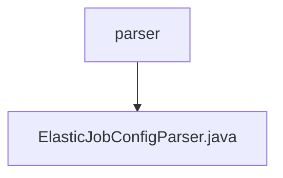

# 基础信息

|      |      |
|------|------|
| 名称 | parser |
| 编码语言 | .java |
| 代码路径 | rabbit-parent/rabbit-task/src/main/java/com/itihub/rabbit/task/parser |
| 包名 | rabbit-parent.docs.rabbit-task.src.main.java.com.itihub.rabbit.task.parser |
| 概述说明 | 解析ElasticJob配置，初始化SpringJobScheduler并注册到Spring容器。 |

# 说明

ElasticJobConfigParser类是一个Spring应用监听器，负责解析带有@ElasticJobConfig注解的作业配置。它通过ZookeeperRegistryCenter和ElasticJobZookeeperProperties初始化，监听ApplicationReadyEvent事件。主要功能包括：获取注解配置的作业实例，根据作业类型（SimpleJob、DataflowJob或ScriptJob）创建对应的JobTypeConfiguration，构建LiteJobConfiguration和JobCoreConfiguration。同时处理作业监听器配置，最终将SpringJobScheduler注册为Spring Bean并初始化。该类还包含辅助方法用于构建核心配置、轻量级作业配置和监听器列表。

### 包内部结构视图

该流程图展示了rabbit-task项目中的解析器模块结构，顶层为parser目录，其下包含一个具体的解析器实现文件ElasticJobConfigParser.java。这种单层结构表明该模块功能集中，主要用于处理ElasticJob的配置解析任务，体现了简洁的职责划分。

# 文件列表 File List

| 名称   | 类型  | 说明 |
|-------|------|-------------|
| [ElasticJobConfigParser.java](ElasticJobConfigParser.md) | file | 解析ElasticJob配置，初始化SpringJobScheduler并注册到Spring容器。 |

