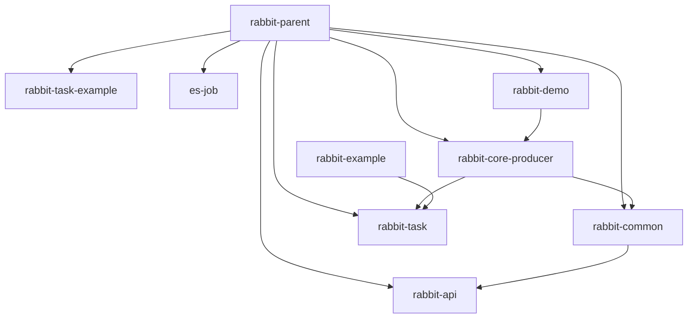

[回到首页](../README.md)

## 项目概览
### 项目基本信息
- **名称:** rabbit-parent
- **GroupId (Maven):** com.itihub.base.rabbit
- **ArtifactId (Maven):** rabbit-parent
- **Version:** 1.0-SNAPSHOT
- **主要编程语言:** Java

## 先决条件
- **JDK 版本:** 1.8 (通过 Maven 的 `<java.version>1.8</java.version>` 属性明确指定)
- **构建工具版本:** Maven (通过 `pom.xml` 文件结构和 `<modelVersion>4.0.0</modelVersion>` 标识)
- **网络连接中间件依赖:**
  - **RabbitMQ:** 通过 `spring-boot-starter-amqp` 依赖（版本由 Spring Boot 2.2.4.RELEASE 管理）
  - **MySQL:** 通过 `mysql-connector-java` 依赖（版本由 Spring Boot 2.2.4.RELEASE 管理）
  - **Elastic-Job:** 
    - `elastic-job-lite-core` 2.1.5
    - `elastic-job-lite-spring` 2.1.5
  - **Druid 连接池:** 1.0.24 (通过 `<druid.version>` 属性指定)

## 构建指南
### Maven 构建
- 构建命令:
    - 清理构建: `mvn clean`
    - 编译项目: `mvn compile`
    - 打包项目: `mvn package`
    - 安装到本地仓库: `mvn install`
    - 部署项目: `mvn deploy`
- 构建流程: 
    - Maven 的构建流程主要包括以下阶段：
        1. **清理 (clean)**: 删除之前构建生成的文件。
        2. **验证 (validate)**: 验证项目是否正确且所有必要信息可用。
        3. **编译 (compile)**: 编译项目的源代码。
        4. **测试 (test)**: 使用合适的单元测试框架运行测试。
        5. **打包 (package)**: 将编译后的代码打包成可分发的格式（如 JAR、WAR）。
        6. **验证 (verify)**: 对集成测试的结果进行检查以确保质量。
        7. **安装 (install)**: 将包安装到本地仓库，供其他项目依赖。
        8. **部署 (deploy)**: 将最终的包复制到远程仓库供其他开发者和项目使用。
- 打包目录: 
    - 打包后的文件通常位于 `target/` 目录下：
        - 主模块的 JAR/WAR 文件：`target/<artifactId>-<version>.jar` 或 `target/<artifactId>-<version>.war`。
        - 测试报告：`target/surefire-reports/`。
        - 生成的源码和文档（如果配置了相关插件）：`target/generated-sources/` 和 `target/site/`。
    - 对于多模块项目（如 `rabbit-parent`），每个子模块会在其各自的 `target/` 目录下生成对应的构建输出。

## 依赖管理
### 主要依赖
- **Spring Boot Starter Parent**: 提供 Spring Boot 项目的默认配置和依赖管理，版本 `2.2.4.RELEASE`。
- **Lombok**: 用于简化 Java 代码（如自动生成 getter/setter），版本 `1.18.10`，作用域为 `provided`。
- **Guava**: Google 的核心库，提供集合、缓存等工具，版本 `${guava.version}`（实际为 `20.0`）。
- **Apache Commons Lang3**: 提供字符串、数组等工具类，版本 `${commons-lang3.version}`（实际为 `3.9`）。
- **Fastjson**: 阿里巴巴的 JSON 处理库，版本 `${fastjson.version}`（实际为 `1.2.62`）。
- **Elastic-Job**: 分布式任务调度框架，版本 `2.1.5`（直接依赖，未通过属性管理）。
- **Spring Boot Starters**: 
  - `spring-boot-starter-web`（Web 支持）
  - `spring-boot-starter-test`（测试支持）
  - `spring-boot-starter-amqp`（RabbitMQ 支持）
  - `spring-boot-starter-jdbc`（JDBC 支持）
- **MyBatis Spring Boot Starter**: MyBatis 集成，版本 `1.3.2`。
- **Druid**: 阿里巴巴的数据库连接池，版本 `${druid.version}`（实际为 `1.0.24`）。

### 添加/修改依赖
- **Maven:** 在 `pom.xml` 文件的 `<dependencies>` 标签中添加或修改 `<dependency>` 元素。例如：
  ```xml
  <dependency>
      <groupId>org.springframework.boot</groupId>
      <artifactId>spring-boot-starter-web</artifactId>
  </dependency>
  ```

### 依赖版本管理
- **Maven (`<dependencyManagement>`):** 
  - 父项目（`rabbit-parent`）通过 `<dependencyManagement>` 统一管理子模块的依赖版本，避免冲突。
  - 版本通过属性（如 `${guava.version}`）集中定义，便于维护。
  - 子模块继承父项目的依赖管理，无需重复指定版本（如 `commons-lang3` 在子模块中未显式声明版本）。
  - 例外：部分依赖（如 `elastic-job-lite-core`）直接在子模块中指定版本，绕过父项目管理。

## 模块依赖关系图




## 工程结构

```
rabbit-parent/
├── rabbit-demo/                # 示例演示模块（标准命名）
│   ├── src/
│   │   ├── main/
│   │   │   ├── java/com/itihub/rabbit/demo/  # 示例应用入口
│   │   │   └── resources/                   # 应用配置
│   │   └── test/                            # 单元测试
├── rabbit-task/               # 定时任务模块（含ElasticJob注解）
│   ├── src/
│   │   ├── main/
│   │   │   ├── java/com/itihub/rabbit/task/  # 任务解析与自动配置
│   │   │   └── resources/META-INF/           # Spring自动化配置
├── rabbit-core-producer/      # 核心消息生产模块
│   ├── src/
│   │   ├── main/
│   │   │   ├── java/com/itihub/rabbit/producer/  # 消息存储/重试/路由逻辑
│   │   │   └── resources/                        # 数据库脚本及配置
├── rabbit-api/                # 消息服务接口定义
│   ├── src/
│   │   ├── main/
│   │   │   └── java/com/itihub/rabbit/api/  # 消息类型/回调接口
├── rabbit-task-example/       # 任务模块示例（演示用法）
│   ├── src/
│   │   ├── main/
│   │   │   ├── java/com/itihub/rabbit/task/example/  # 示例任务实现
│   │   │   └── resources/                            # 示例配置
├── es-job/                    # ElasticJob实现模块
│   ├── src/
│   │   ├── main/
│   │   │   ├── java/com/itihub/esjob/  # 任务配置与监听器
│   │   │   └── resources/              # 任务属性配置
├── rabbit-common/             # 公共工具模块
│   ├── src/
│   │   ├── main/
│   │   │   └── java/com/itihub/rabbit/common/  # 序列化/类型转换工具
├── scripts/                   # 运维脚本（数据库/容器）
│   ├── docker/                # RabbitMQ容器配置
│   └── db/migration/          # 数据库迁移脚本
├── .git/                      # 版本控制目录
├── Architecture.png           # 架构图
├── pom.xml                    # Maven父POM
└── README.md                  # 项目说明文档
```

命名规约：采用小写中划线风格（如rabbit-core-producer），子包使用Java标准com.itihub前缀
分层结构：模块化设计，核心功能（producer/api）与扩展功能（task/es-job）分离，common提供基础能力
扩展设计：通过独立task/es-job模块支持定时任务扩展，scripts目录提供基础设施配置能力